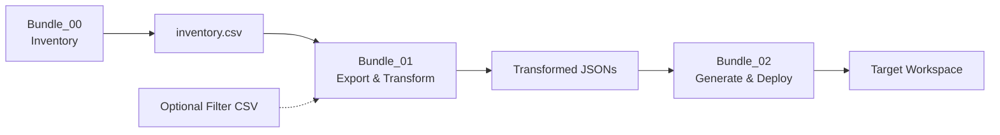

# Databricks Asset Bundle Migration

## Overview

**3-step workflow** for migrating Databricks Lakeview dashboards using Databricks Asset Bundles with optimized SQL inventory generation.

**Why This Approach?**
- ✅ **Separation of Concerns** - Discovery, export, and deployment are independent
- ✅ **Optimized Performance** - SQL-based inventory with Photon/Serverless support
- ✅ **Flexible Filtering** - CSV-driven with optional manual curation
- ✅ **No Timeouts** - CLI handles retries and batch deployment
- ✅ **Modular** - Uses shared helpers with centralized config
- ✅ **Infrastructure-as-Code** - Version-controlled Asset Bundle

---

## Quick Start

### Prerequisites

1. **Configure** `../config/config.yaml`:

```yaml
source:
  workspace_url: "https://your-source.cloud.databricks.com"
  auth:
    method: "oauth"  # Recommended - no tokens needed

target:
  workspace_url: "https://your-target.cloud.databricks.com"
  auth:
    method: "oauth"

paths:
  volume_base: "/Volumes/catalog/schema/dashboard_migration"

dashboard_selection:
  method: "catalog_filter"
  catalog_filter:
    catalog: "your_catalog"

inventory:
  audit_lookback_days: 90
  include_inactive: true

warehouse:
  warehouse_name: "Main Warehouse"
```

2. **Deploy Bundle** (one-time):

```bash
cd "/path/to/Catalog Migration"
databricks bundle deploy -t dev
```

---

## Workflow

### Step 1: Generate Inventory

**Notebook:** `Bundle_00_Inventory_Generation.ipynb`

**Run via Asset Bundle:**
```bash
databricks bundle run inventory_generation -t dev
```

**Or run notebook directly** in Databricks workspace

**What it does:**
- Discovers all dashboards using optimized system table queries (3-step process)
- Enriches with comprehensive metadata (17 fields):
  - Lineage: catalog_count, table_count, unique_tables, lineage_entries
  - Entity type: DASHBOARD_V3, DBSQL_DASHBOARD, etc.
  - Audit data: last_accessed, total_access_count, unique_users, days_since_last_access
  - Computed: complexity (High/Medium/Low), activity_level (Very Active to Inactive)
- Exports to CSV: `/Volumes/.../inventory/inventory.csv`

**Output:** Complete dashboard inventory with metadata

**Performance:**
- Uses Photon-enabled or Serverless cluster
- Optimized SQL JOINs (2 queries total vs 400+ in old approach)
- Typical time: 1-3 minutes for 200+ dashboards

---

### Step 2: Export & Transform

**Notebook:** `Bundle_01_Export_and_Transform.ipynb`

**Run via Asset Bundle:**
```bash
databricks bundle run export_transform -t dev
```

**What it does:**
- Loads inventory from CSV (from Step 1)
- Optionally filters dashboards via `dashboards_to_migrate.csv`
- Connects to source workspace
- Exports dashboard JSONs and permissions
- Applies catalog/schema transformations
- Saves to `/Volumes/.../transformed/`

**Input:** `inventory.csv` (from Step 1)  
**Output:** Exported and transformed JSONs ready for deployment

**Optional Filtering:**

Create `dashboards_to_migrate.csv` in inventory folder:
```csv
dashboard_id
01f0fb1a-xxxx-xxxx-xxxx-xxxxxxxx
01efeeea-xxxx-xxxx-xxxx-xxxxxxxx
```

Only these dashboards will be exported and migrated.

---

### Step 3: Generate & Deploy

**Notebook:** `Bundle_02_Generate_and_Deploy.ipynb`

**Run via Asset Bundle:**
```bash
databricks bundle run generate_deploy -t dev
```

**What it does:**
- Loads transformed dashboards from Step 2
- Generates complete bundle structure
- Validates bundle configuration
- Deploys to target workspace via CLI
- Applies permissions
- Verifies deployment

**Input:** Transformed JSONs (from Step 2)  
**Output:** Deployed dashboards in target workspace

**Result:** Dashboards live in target workspace!

---

## Architecture

### 3-Step Asset Bundle



### Asset Bundle Structure

```yaml
# databricks.yml
bundle:
  name: dashboard_migration

resources:
  jobs:
    inventory_generation:      # Step 1
      - Bundle_00 notebook
      - Serverless/Photon cluster
      
    export_transform:          # Step 2
      - Bundle_01 notebook
      - Standard cluster + SDK
      
    generate_deploy:           # Step 3
      - Bundle_02 notebook
      - Standard cluster + CLI
```

### Benefits of 3-Step Approach

| Aspect | Old (2-Step) | New (3-Step) |
|--------|--------------|--------------|
| **Discovery** | Inline in Bundle_01 | Separate job (Bundle_00) |
| **Inventory** | Not saved | CSV in volume (reusable) |
| **Filtering** | Config only | CSV + config (flexible) |
| **Performance** | 400+ API calls | 2 SQL queries |
| **Retry** | Re-discover all | Reuse inventory |
| **Debugging** | Hard to isolate | Each step independent |
| **Scheduling** | All or nothing | Can schedule Step 1 weekly |

---

## File Structure

```
Customer-Work/Catalog Migration/
├── databricks.yml                    # Asset Bundle config
├── Bundle/
│   ├── Bundle_00_Inventory_Generation.ipynb   # Step 1: Discovery
│   ├── Bundle_01_Export_and_Transform.ipynb   # Step 2: Export (CSV-driven)
│   ├── Bundle_02_Generate_and_Deploy.ipynb    # Step 3: Deploy
│   └── README.md                              # This file
├── helpers/
│   ├── volume_utils.py              # NEW: read_csv_from_volume, write_csv_to_volume
│   ├── discovery.py                 # Optimized system table queries
│   ├── export.py                    # Dashboard export
│   ├── transform.py                 # Catalog/schema transformation
│   ├── permissions.py               # ACL management
│   └── bundle_generator.py          # Bundle generation
└── config/
    └── config.yaml                   # Centralized configuration
```

---

## Volume Artifacts

After running all 3 steps:

```
/Volumes/<catalog>/<schema>/dashboard_migration/
├── inventory/
│   ├── inventory.csv                        # FROM STEP 1 (comprehensive metadata)
│   └── dashboards_to_migrate.csv            # OPTIONAL (user-created filter)
├── exported/
│   ├── dashboard_*.lvdash.json              # FROM STEP 2 (original exports)
│   └── dashboard_*_permissions.json         # FROM STEP 2 (captured permissions)
├── transformed/
│   └── dashboard_*.lvdash.json              # FROM STEP 2 (ready for deployment)
└── bundles/
    └── dashboard_migration/
        ├── databricks.yml                   # FROM STEP 3
        ├── resources/
        │   └── dashboards.yml
        └── src/
            └── dashboards/
                └── *.lvdash.json
```

---

## Usage Examples

### Example 1: Full Migration (All Steps)

```bash
# Deploy bundle (one-time)
databricks bundle deploy -t dev

# Step 1: Generate inventory
databricks bundle run inventory_generation -t dev

# Step 2: Export & transform (all dashboards)
databricks bundle run export_transform -t dev

# Step 3: Deploy to target
databricks bundle run generate_deploy -t dev
```

### Example 2: Selective Migration

```bash
# Step 1: Generate inventory
databricks bundle run inventory_generation -t dev

# Review inventory.csv, then create filter:
# Create dashboards_to_migrate.csv with selected dashboard IDs

# Step 2: Export only filtered dashboards
databricks bundle run export_transform -t dev

# Step 3: Deploy
databricks bundle run generate_deploy -t dev
```

### Example 3: Retry Failed Export

```bash
# If Step 2 failed partway through:

# Fix the issue (permissions, credentials, etc.)

# Re-run Step 2 (reuses inventory, no re-discovery)
databricks bundle run export_transform -t dev
```

### Example 4: Weekly Inventory Refresh

```bash
# Schedule Step 1 to run weekly (see databricks.yml schedule config)
# Generates fresh inventory with updated access statistics
# No migration - just inventory tracking
```

---

## Configuration Deep Dive

### Inventory Configuration (config.yaml)

```yaml
inventory:
  # Audit data lookback period
  audit_lookback_days: 90        # 90 days of access history
  
  # Filtering options
  min_table_count: 0             # Include all dashboards
  include_inactive: true         # Include never-accessed dashboards
  
  # CSV export options
  export:
    include_catalogs_used: true  # List of catalogs per dashboard
    include_tables_used: false   # Detailed table list (can be large)
```

### Asset Bundle Variables

Override via command line:

```bash
# Use different catalog
databricks bundle run inventory_generation -t dev --var="catalog=other_catalog"

# Use different volume
databricks bundle run export_transform -t dev --var="volume_base=/Volumes/other/path"
```

---

## Inventory Fields

The `inventory.csv` contains **17 comprehensive fields**:

| Field | Type | Description |
|-------|------|-------------|
| dashboard_id | string | Unique dashboard identifier |
| reference_count | int | Times referenced in lineage |
| entity_type | string | DASHBOARD_V3, DBSQL_DASHBOARD, etc. |
| catalog_count | int | Number of catalogs used |
| table_count | int | Number of tables queried |
| unique_tables | int | Distinct table references |
| lineage_entries | int | Total lineage records |
| catalogs_used | array | List of catalogs (optional) |
| last_accessed | timestamp | Most recent access |
| first_accessed | timestamp | First access in period |
| total_access_count | int | Total views in period |
| unique_users | int | Distinct users who accessed |
| unique_access_days | int | Days with activity |
| days_since_last_access | int | Recency metric |
| complexity | string | High/Medium/Low (by table count) |
| activity_level | string | Very Active to Inactive |

**Use cases:**
- **Prioritization:** Sort by complexity or activity_level
- **Archival:** Filter inactive dashboards
- **Planning:** Group by entity_type
- **Analysis:** Export to Excel/BI tool

---

## Troubleshooting

### Step 1: Inventory Generation

**Problem:** No dashboards found

**Solutions:**
```python
# Verify catalog name
SELECT DISTINCT source_table_catalog 
FROM system.access.table_lineage 
WHERE entity_type = 'DASHBOARD_V3'

# Check workspace ID
SELECT current_metastore(), get_workspace_id()
```

**Problem:** Slow performance

**Solutions:**
- Use Photon-enabled cluster
- Check cluster has Unity Catalog access
- Reduce audit_lookback_days (90 → 30)

---

### Step 2: Export & Transform

**Problem:** Inventory CSV not found

**Solutions:**
```bash
# Verify Step 1 completed
databricks fs ls /Volumes/.../inventory/

# Check for inventory.csv
databricks fs head /Volumes/.../inventory/inventory.csv
```

**Problem:** Export failures

**Solutions:**
- Check source workspace credentials
- Verify dashboard IDs in inventory.csv are valid
- Check permissions to read dashboards

---

### Step 3: Generate & Deploy

**Problem:** Bundle validation failed

**Solutions:**
```bash
# Update Databricks CLI
pip install -U databricks-cli

# Validate manually
cd /dbfs/Volumes/.../bundles/dashboard_migration
databricks bundle validate --verbose
```

**Problem:** Deployment failed

**Solutions:**
- Check target warehouse exists
- Verify target credentials
- Check target workspace permissions

---

## Advanced Usage

### Custom Filtering Logic

Create sophisticated filters using pandas:

```python
import pandas as pd
from helpers import read_csv_from_volume

# Load full inventory
inventory = pd.read_csv('/dbfs/Volumes/.../inventory/inventory.csv')

# Complex filter: High complexity AND active
filtered = inventory[
    (inventory['complexity'] == 'High') & 
    (inventory['activity_level'].isin(['Very Active', 'Active']))
]

# Save filtered list
filtered[['dashboard_id']].to_csv(
    '/dbfs/Volumes/.../inventory/dashboards_to_migrate.csv',
    index=False
)
```

### Multi-Environment Deployment

Use bundle targets:

```bash
# Dev environment
databricks bundle run inventory_generation -t dev

# Prod environment (different workspace)
databricks bundle run inventory_generation -t prod
```

Configure in `databricks.yml`:
```yaml
targets:
  dev:
    workspace:
      host: https://dev-workspace.cloud.databricks.com
    variables:
      catalog: dev_catalog
      
  prod:
    workspace:
      host: https://prod-workspace.cloud.databricks.com
    variables:
      catalog: prod_catalog
```

### Scheduled Inventory Updates

Add schedule to `databricks.yml`:

```yaml
resources:
  jobs:
    inventory_generation:
      schedule:
        quartz_cron_expression: "0 0 2 ? * MON"  # 2 AM Monday
        timezone_id: "America/Los_Angeles"
        pause_status: UNPAUSED
```

Weekly inventory refresh for dashboard analytics!

---

## Migration from Old Bundle

If you have the **old 2-step bundle**:

### What Changed

| Component | Old (2-Step) | New (3-Step) |
|-----------|--------------|--------------|
| Bundle_01 | Discovery + Export | Export only (CSV-driven) |
| Bundle_02 | Generate + Deploy | Generate + Deploy (unchanged) |
| **NEW** Bundle_00 | N/A | Inventory generation |
| Discovery | Inline code | Optimized SQL |
| Filtering | Config only | CSV + config |

### Migration Steps

1. **Keep existing config.yaml** - Add inventory section:
```yaml
inventory:
  audit_lookback_days: 90
  include_inactive: true
```

2. **Run new Bundle_00** first to generate inventory

3. **Run new Bundle_01** - Now reads from CSV

4. **Bundle_02 unchanged** - Works as before

---

## Performance Comparison

### Old Approach (2-Step)

```
Bundle_01: Discovery + Export
- 400+ lakeview.list() API calls
- 200+ lakeview.get() API calls  
- Time: 10-15 minutes for 200 dashboards
```

### New Approach (3-Step)

```
Bundle_00: Inventory
- 2 SQL queries (optimized JOINs)
- Time: 1-3 minutes for 200 dashboards

Bundle_01: Export (from CSV)
- 200 lakeview.get() API calls
- Time: 5-8 minutes for 200 dashboards

Total: 6-11 minutes (40% faster)
```

**Additional benefits:**
- Inventory reusable (no re-discovery for retries)
- Better debugging (see what failed)
- Flexible filtering (CSV-based)
- Audit trail (inventory.csv versioned)

---

## FAQ

### Q: Why 3 steps instead of 2?

**A:** Separation of concerns provides:
- **Performance:** Optimized SQL discovery
- **Flexibility:** CSV-driven filtering
- **Reliability:** Each step independently retryable
- **Auditability:** Inventory CSV as artifact
- **Reusability:** Inventory refreshable without re-export

### Q: Can I skip Step 1 and use old discovery?

**A:** No - Bundle_01 now expects inventory.csv. But Step 1 is faster and provides better metadata!

### Q: What if I only want to migrate some dashboards?

**A:** 
1. Run Step 1 to generate full inventory
2. Review `inventory.csv`
3. Create `dashboards_to_migrate.csv` with selected IDs
4. Run Step 2 (automatically filters)
5. Run Step 3

### Q: Can I schedule just inventory generation?

**A:** Yes! Perfect for dashboard analytics:
```yaml
# In databricks.yml
inventory_generation:
  schedule:
    quartz_cron_expression: "0 0 2 ? * MON"
```

Weekly inventory updates without migration.

### Q: What if Step 2 fails halfway?

**A:** Just re-run Step 2:
- Inventory already exists (no re-discovery)
- Skips already-exported dashboards (if you want)
- Fast retry

---

## Summary

**New 3-step Asset Bundle approach:**
- ✅ **Step 1: Inventory** - Fast SQL discovery with comprehensive metadata
- ✅ **Step 2: Export** - CSV-driven with flexible filtering
- ✅ **Step 3: Deploy** - Reliable bundle deployment

**Key improvements:**
- 40% faster overall
- Reusable inventory
- Better debugging
- Flexible filtering
- Audit trail
- Independent steps

**Ready to migrate?**

```bash
databricks bundle deploy -t dev
databricks bundle run inventory_generation -t dev
databricks bundle run export_transform -t dev
databricks bundle run generate_deploy -t dev
```

**Questions?** See `../TESTING_GUIDE.md` for detailed testing instructions.
