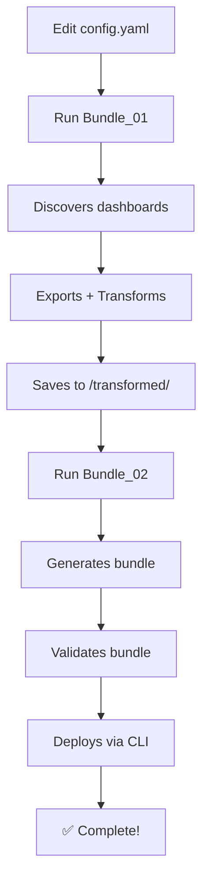

# Bundle Approach: Dashboard Migration

## Overview

Streamlined **2-notebook workflow** for migrating Databricks Lakeview dashboards using Databricks Asset Bundles.

**Why Bundle Approach?**
- ✅ **No timeouts** (CLI handles retries)
- ✅ **Batch deployment** (all dashboards at once)
- ✅ **Simpler** (2 notebooks vs 5)
- ✅ **Modular** (uses shared helpers/)
- ✅ **Reliable** (Infrastructure-as-Code)

---

## Quick Start

### 1. Configure

Edit `../config/config.yaml` (one-time setup):

```yaml
source:
  workspace_url: "https://your-source.cloud.databricks.com"
  auth:
    method: "pat"  # Options: "pat", "oauth", "service_principal"
    pat:
      secret_scope: "migration"
      secret_key: "source-token"
    
    # OAuth (RECOMMENDED by Databricks - uncomment to use)
    # method: "oauth"
    # Note: No secrets needed with OAuth - uses notebook authentication

target:
  workspace_url: "https://your-target.cloud.databricks.com"
  auth:
    method: "pat"  # Options: "pat", "oauth", "service_principal"
    pat:
      secret_scope: "migration"
      secret_key: "target-token"
    
    # OAuth (RECOMMENDED by Databricks - uncomment to use)
    # method: "oauth"
    # Note: No secrets needed with OAuth - uses notebook authentication

paths:
  volume_base: "/Volumes/catalog/schema/dashboard_migration"
  target_parent_path: "/Shared/Migrated_Dashboards"

dashboard_selection:
  method: "catalog_filter"
  catalog_filter:
    catalog: "your_catalog"

warehouse:
  warehouse_name: "Main Warehouse"

bundle:
  name: "dashboard_migration"
  embed_credentials: true
```

### 2. Run Bundle_01

**Notebook:** `Bundle_01_Export_and_Transform.ipynb`

**What it does:**
- Discovers dashboards from source
- Exports JSONs and permissions
- Transforms catalog/schema names
- Saves to `/Volumes/.../transformed/`

**No configuration needed in notebook** - loads from `config.yaml`

### 3. Run Bundle_02

**Notebook:** `Bundle_02_Generate_and_Deploy.ipynb`

**What it does:**
- Generates bundle structure
- Validates bundle
- Deploys to target workspace
- Applies permissions
- Verifies deployment

**Result:** Dashboards live in target workspace!

---

## Architecture

### Uses Shared Helpers

Both Bundle notebooks now use the **same helper modules** as Manual notebooks:

```
helpers/
├── auth.py              # Authentication
├── discovery.py         # Dashboard discovery
├── export.py            # Export functions
├── transform.py         # Transformation logic
├── permissions.py       # ACL management
├── bundle_generator.py  # Bundle-specific helpers
└── ...
```

**Benefits:**
- No code duplication
- Single source of truth
- Bug fixes apply everywhere
- Easier to maintain

### Bundle-Specific Helper: `bundle_generator.py`

New module for bundle operations:

```python
from helpers import (
    generate_bundle_structure,  # Creates bundle files
    validate_bundle,             # Validates with CLI
    deploy_bundle                # Deploys to target
)
```

---

## Workflow



---

## What Changed (Modularization)

### Before (Old Bundle Notebooks)

```python
# Bundle_01 Cell 4 - 50+ lines of discovery code
for dash in client.lakeview.list(...):
    # ... lots of code ...

# Bundle_01 Cell 5 - 40+ lines of export code
dash = client.lakeview.get(dashboard_id)
# ... lots of code ...

# Bundle_01 Cell 6 - 60+ lines of transform code
def find_and_replace_references(...):
    # ... lots of code ...

# Total: ~1200 lines across both notebooks
```

### After (New Bundle Notebooks)

```python
# Bundle_01 - Uses helpers
from helpers import (
    load_config,
    discover_dashboards,
    export_dashboard,
    transform_dashboard_json
)

config = load_config('../config/config.yaml')
dashboards = discover_dashboards(client)
# ... clean, simple orchestration ...

# Total: ~200 lines across both notebooks
```

**Result:** 83% reduction in code size!

---

## Configuration

### Single config.yaml

**Before:** Configuration in each notebook cell

**After:** Single `config/config.yaml` loaded automatically

**Example:**

```python
# No more this:
SOURCE_WORKSPACE_URL = "https://..."
TARGET_WORKSPACE_URL = "https://..."
VOLUME_BASE = "/Volumes/..."
# ... 50+ lines of config in EACH notebook

# Instead:
config = load_config('../config/config.yaml')
# Done! All notebooks use same config
```

---

## Bundle vs Manual Approach

| Feature | Bundle Approach | Manual Approach |
|---------|-----------------|-----------------|
| **Notebooks** | 2 | 2 |
| **Import method** | Automated (CLI) | Manual (UI/Bundle/Custom) |
| **Timeouts** | Rare | None (manual) |
| **Permissions** | Integrated in deploy | Separate notebook |
| **Use case** | Production, IaC | Testing, flexibility |
| **Code reuse** | Uses helpers/ | Uses helpers/ |
| **Configuration** | config.yaml | config.yaml |

**Both approaches now use the same helpers and config!**

---

## Comparison: Old vs New Bundle

| Aspect | Old Bundle | New Modular Bundle |
|--------|-----------|-------------------|
| **Lines of code** | ~1200 | ~200 |
| **Configuration** | In notebooks | config.yaml |
| **Discovery** | Copied code | helpers.discover |
| **Export** | Copied code | helpers.export |
| **Transform** | Copied code | helpers.transform |
| **Permissions** | Copied code | helpers.permissions |
| **Bundle gen** | Inline | helpers.bundle_generator |
| **Maintenance** | Difficult | Easy |
| **Testing** | Hard | Modules testable |

---

## Testing

See `../TESTING_GUIDE.md` for complete step-by-step testing instructions.

**Quick test:**

1. Configure `config/config.yaml`
2. Run `Bundle_01_Export_and_Transform.ipynb`
3. Run `Bundle_02_Generate_and_Deploy.ipynb`
4. Verify in target workspace

---

## Files Generated

```
/Volumes/.../dashboard_migration/
├── exported/
│   ├── dashboard_*.lvdash.json          # Original exports
│   └── dashboard_*_permissions.json     # Captured permissions
├── transformed/
│   └── dashboard_*.lvdash.json          # Transformed (ready for bundle)
└── bundles/
    └── dashboard_migration/
        ├── databricks.yml               # Main bundle config
        ├── resources/
        │   └── dashboards.yml           # Dashboard resources
        └── src/
            └── dashboards/
                └── *.lvdash.json        # Dashboard files
```

---

## Troubleshooting

### Bundle validation failed

**Check Databricks CLI version:**
```bash
%pip install -U databricks-cli
dbutils.library.restartPython()
```

### Transformation not working

**Verify mappings:**
```python
# Check CSV exists and has correct format
dbutils.fs.head("/Volumes/.../mappings/catalog_schema_mapping.csv", 500)
```

**Check transformed file:**
```python
# Should show NEW catalog names
dbutils.fs.head("/Volumes/.../transformed/dashboard_*.json", 1000)
```

### Deployment failed

**Common causes:**
1. Warehouse not found → Check warehouse name/ID
2. Permission denied → Check target credentials
3. Invalid bundle → Run validation first

**Debug:**
```python
# Validate manually
cd /dbfs/Volumes/.../bundles/dashboard_migration
databricks bundle validate --verbose
```

---

## Advanced Usage

### Multi-Environment

Use same config for dev/staging/prod:

```yaml
# config/config_prod.yaml
target:
  workspace_url: "https://prod-workspace..."
  
# config/config_dev.yaml
target:
  workspace_url: "https://dev-workspace..."
```

Load specific config:
```python
config = load_config('../config/config_prod.yaml')
```

### Custom Transformations

Add custom logic to `helpers/transform.py` - automatically used by all notebooks.

### Bundle Customization

Extend `helpers/bundle_generator.py` for custom bundle features.

---

## Migration from Old Bundle Notebooks

If you have old Bundle notebooks:

1. **Archive old notebooks** (already done in `_archive/`)
2. **Update config** - Move config from notebook cells to `config/config.yaml`
3. **Use new notebooks** - `Bundle_01` and `Bundle_02` in this folder
4. **Test** - Follow `TESTING_GUIDE.md`

---

## FAQ

### Q: Why modularize Bundle notebooks?

**A:** Same benefits as Manual notebooks:
- Single config file
- No code duplication
- Same transformation logic
- Easier to maintain
- Testable helpers

### Q: Will my existing workflow break?

**A:** No! Old Bundle notebooks are archived but still work. New notebooks are cleaner and use helpers.

### Q: What if I need custom logic?

**A:** Extend helper modules. Changes apply to all notebooks automatically.

### Q: Can I still use old notebooks?

**A:** Yes, but new ones are better:
- 83% less code
- Centralized config
- Shared helpers
- Easier to use

---

## Summary

**New Bundle approach:**
- ✅ Modular (uses helpers/)
- ✅ Configured (config.yaml)
- ✅ Simple (200 lines vs 1200)
- ✅ Reliable (no timeouts)
- ✅ Maintainable (single source of truth)

**Ready to test?** See `../TESTING_GUIDE.md`

**Questions?** See `../README_MODULAR.md` for full architecture
