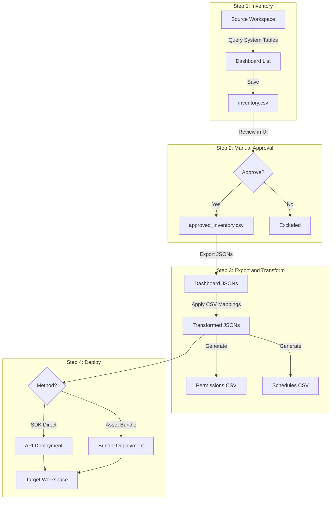

# Databricks Dashboard Migration Toolkit

**Created by Archana Krishnamurthy, Sr Delivery Solutions Architect, Databricks**

Complete solution for migrating Databricks Lakeview dashboards across workspaces with catalog/schema transformations.

## Features

- **Automated Discovery**: System table queries for dashboard inventory
- **Manual Approval**: Review and approve dashboards before migration
- **Catalog Transformation**: Remap catalog.schema.table references via CSV
- **Permission Migration**: Capture and apply ACLs
- **Schedule Migration**: Capture and apply schedules/subscriptions
- **Dual Deployment**: SDK Direct or Asset Bundle methods
- **Runtime Overrides**: CLI parameters for dry_run, target_path, deployment_method
- **Multi-Environment**: Dev, staging, prod configurations

## Prerequisites

- Databricks CLI v0.218.0+ installed locally
- CLI profiles configured in `~/.databrickscfg`
- Workspace Admin access on source and target workspaces
- Unity Catalog volume for storing artifacts
- SQL warehouse in target workspace
- Secret scope with PAT token for cross-workspace auth

### Quick CLI Setup

```bash
# Install CLI
pip install databricks-cli --upgrade
databricks --version  # Must be >= 0.218.0

# Configure profiles
databricks configure --profile source-workspace
databricks configure --profile target-workspace

# Test profiles
databricks workspace list --profile source-workspace
databricks workspace list --profile target-workspace

# Create secret scope and store target workspace PAT
databricks secrets create-scope migration_secrets --profile source-workspace
databricks secrets put-secret migration_secrets target_workspace_token --profile source-workspace
```

## Migration Flow



## Quick Start

### 1. Configure Environment

Edit `databricks.yml` target variables:

```yaml
targets:
  dev:
    workspace:
      host: https://your-source-workspace.cloud.databricks.com
    variables:
      catalog: your_source_catalog
      volume_base: /Volumes/catalog/schema/migration_volume
      source_workspace_url: https://source-workspace.cloud.databricks.com
      target_workspace_url: https://target-workspace.cloud.databricks.com
      warehouse_id: "your_warehouse_id"  # 16-char hex ID
```

### 2. Create Catalog Mapping CSV

Upload to `/Volumes/catalog/schema/volume/mappings/catalog_schema_mapping.csv`:

```csv
old_catalog,old_schema,old_table,new_catalog,new_schema,new_table,old_volume,new_volume
dev_catalog,bronze,customers,prod_catalog,gold,customers,,
dev_catalog,bronze,,prod_catalog,gold,,,
```

### 3. Run Migration

```bash
cd "Customer-Work/Catalog Migration"

# Deploy bundle (one-time setup)
databricks bundle deploy -t dev --profile source-workspace

# Step 1: Generate inventory
databricks bundle run inventory_generation -t dev --profile source-workspace

# Step 2: Manual approval (open Bundle_02 in Databricks UI)
# Review and approve dashboards interactively

# Step 3: Export & transform
databricks bundle run export_transform -t dev --profile source-workspace

# Step 4: Deploy (dry run first - safe)
databricks bundle run generate_deploy -t dev --profile source-workspace

# Step 4: Deploy (live - creates resources)
databricks bundle run generate_deploy -t dev --params "dry_run_mode=false" --profile source-workspace
```

## Workflow Steps Detail

### Step 1: Inventory Generation

**Notebook**: `Bundle/Bundle_01_Inventory_Generation.ipynb`

Discovers all dashboards and generates inventory CSV.

```bash
databricks bundle run inventory_generation -t dev --profile source-workspace
```

### Step 2: Manual Review and Approval

**Notebook**: `Bundle/Bundle_02_Review_and_Approve_Inventory.ipynb`

**This step requires manual intervention in the Databricks UI:**
1. Open the notebook in your source workspace
2. Review the inventory table
3. Select/deselect dashboards to migrate
4. Run the approval cell to save `approved_inventory.csv`

### Step 3: Export and Transform

**Notebook**: `Bundle/Bundle_03_Export_and_Transform.ipynb`

Exports approved dashboards and applies catalog transformations.

```bash
databricks bundle run export_transform -t dev --profile source-workspace
```

**What it does:**
- Exports dashboard JSONs from source
- Captures permissions to `all_permissions.csv`
- Captures schedules to `all_schedules.csv`
- Applies CSV mappings to transform catalog references
- Saves to `exported/` and `transformed/` directories

### Step 4: Generate and Deploy

**Notebook**: `Bundle/Bundle_04_Generate_and_Deploy.ipynb`

Deploys dashboards to target workspace.

## Runtime Parameter Overrides

Step 4 supports runtime parameter overrides via `--params`:

| Parameter | Default | Description |
|-----------|---------|-------------|
| `dry_run_mode` | `true` | Preview only (no resources created) |
| `deployment_method` | `sdk_direct` | `sdk_direct` or `asset_bundle` |
| `target_parent_path` | `/Shared/Migrated_Dashboards_V2` | Target folder path |

### CLI Examples

```bash
# Dry run (default - safe preview)
databricks bundle run generate_deploy -t dev --profile source-workspace

# Live deployment
databricks bundle run generate_deploy -t dev \
  --params "dry_run_mode=false" \
  --profile source-workspace

# SDK deployment to custom path
databricks bundle run generate_deploy -t dev \
  --params "dry_run_mode=false,target_parent_path=/Shared/Production/Dashboards" \
  --profile source-workspace

# Asset Bundle deployment
databricks bundle run generate_deploy -t dev \
  --params "dry_run_mode=false,deployment_method=asset_bundle" \
  --profile source-workspace

# Multiple overrides
databricks bundle run generate_deploy -t dev \
  --params "dry_run_mode=false,deployment_method=asset_bundle,target_parent_path=/Shared/Test" \
  --profile source-workspace
```

## Deployment Methods

| Feature | SDK Direct (Default) | Asset Bundle |
|---------|---------------------|--------------|
| Dashboards | API calls | Bundle deploy |
| Permissions | Immediate | Bundle deploy |
| Schedules | Immediate | SDK post-deploy |
| Complexity | Simple | Medium |
| Best For | General migrations | IaC workflows |

## Project Structure

```
Catalog Migration/
├── databricks.yml                    # Bundle configuration
├── README.md                         # This file
├── catalog_schema_mapping_template.csv
├── Bundle/
│   ├── Bundle_01_Inventory_Generation.ipynb
│   ├── Bundle_02_Review_and_Approve_Inventory.ipynb
│   ├── Bundle_03_Export_and_Transform.ipynb
│   └── Bundle_04_Generate_and_Deploy.ipynb
└── helpers/
    ├── __init__.py
    ├── auth.py                       # Workspace authentication
    ├── bundle_generator.py           # Asset bundle generation
    ├── config_loader.py              # Configuration utilities
    ├── config_validator.py           # Pre-flight validation
    ├── dbutils_helper.py             # dbutils wrapper
    ├── deployment_package.py         # Deployment data structures
    ├── discovery.py                  # Dashboard discovery
    ├── export.py                     # Dashboard export
    ├── ip_acl_manager.py             # IP whitelist management
    ├── permissions.py                # ACL management
    ├── schedules.py                  # Schedule management
    ├── sdk_deployer.py               # SDK deployment
    ├── sp_oauth_auth.py              # Service Principal auth
    ├── transform.py                  # Catalog transformation
    └── volume_utils.py               # UC volume operations
```

## Configuration Reference

### Key Variables in databricks.yml

| Variable | Description |
|----------|-------------|
| `catalog` | Source catalog to scan |
| `volume_base` | Base path for artifacts (e.g., `/Volumes/cat/schema/vol`) |
| `source_workspace_url` | Source workspace URL |
| `target_workspace_url` | Target workspace URL |
| `warehouse_id` | Target warehouse ID (16-char hex) |
| `transformation_enabled` | Enable catalog mapping (`true`/`false`) |
| `mapping_csv_path` | Path to mapping CSV |
| `apply_permissions` | Apply ACLs to target (`true`/`false`) |
| `apply_schedules` | Apply schedules to target (`true`/`false`) |
| `deployment_method` | `sdk_direct` or `asset_bundle` |
| `dry_run_mode` | Preview without deploying (`true`/`false`) |

## Cross-Workspace Authentication

### PAT Token (Recommended for Quick Setup)

1. Generate PAT in **target** workspace (User Settings → Developer → Access Tokens)
2. Store in secret scope on **source** workspace:
   ```bash
   databricks secrets put-secret migration_secrets target_workspace_token --profile source-workspace
   ```

### Service Principal OAuth (For Production)

See `checklater/SP_OAUTH_SETUP.md` for detailed setup instructions.

## Troubleshooting

### Permission Errors
```bash
# Re-authenticate
databricks auth login --host https://your-workspace.cloud.databricks.com
```

### Bundle Deploy Errors
```bash
# Validate bundle
databricks bundle validate -t dev --profile source-workspace

# Force redeploy
databricks bundle deploy -t dev --profile source-workspace
```

### Job Run Errors
Check the job run URL in the output for detailed error logs.

## What Gets Migrated

**Included:**
- Dashboard structure and layout
- Datasets and queries
- Visualizations and filters
- Catalog/schema/table references (transformed)
- Permissions (ACLs)
- Scheduled refreshes
- Subscriptions

**Not Included:**
- Dashboard history/versions
- Comments and annotations

---

**Version**: 2.1.0  
**Last Updated**: February 2, 2026  
**Status**: Production Ready
