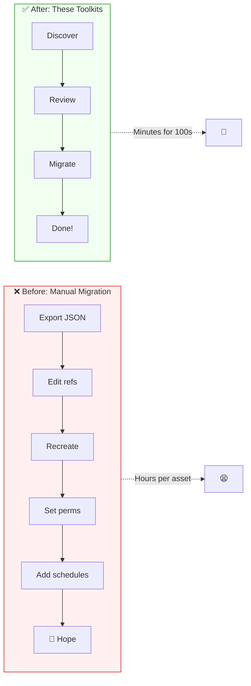
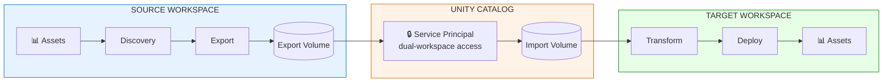

# Databricks migration toolkits

**Empower your analytics teams to migrate Databricks assets — Lakeview dashboards, Unity Catalog–registered models, Genie spaces, and Databricks Apps — across workspaces and catalogs.**

> **Repository name:** This repo is currently named [`databricks-dashboard-migration`](https://github.com/archana986/databricks-dashboard-migration) on GitHub. **It will be renamed in the coming weeks** to better reflect that it contains **four** migration toolkits (not only dashboards). After the rename, update your `git remote` URL if you have already cloned or forked the project.

---

## The Challenge: Data Mesh and Organizational Change

When organizations adopt **Data Mesh**, undergo **workspace consolidation**, or restructure teams, analytics assets don't move themselves. Teams face a critical challenge:

```
┌─────────────────────────────────────────────────────────────────────────────────┐
│                                                                                 │
│   "We're reorganizing into domains. Each team now owns their data products."   │
│                                                                                 │
│   "Great! But what about our 200+ dashboards, trained models, and Genie        │
│    spaces? They all point to the old catalogs and live in the wrong workspace."│
│                                                                                 │
│   "Can't you just... copy them?"                                               │
│                                                                                 │
│   "It's not that simple. Permissions, schedules, subscriptions, catalog        │
│    references, model versions, app configurations... none of that copies."     │
│                                                                                 │
└─────────────────────────────────────────────────────────────────────────────────┘
```

This toolkit collection solves that problem.

---

## Why Terraform Isn't Enough

Terraform is excellent for **infrastructure-as-code**, but analytics asset migration has unique requirements that Terraform doesn't address:

| Requirement | Terraform | These Toolkits |
|-------------|-----------|----------------|
| **Lakeview Dashboards** | ❌ Legacy dashboards only | ✅ Full AI/BI dashboard support |
| **Cross-Workspace Migration** | ❌ Complex state management | ✅ Native cross-workspace design |
| **Catalog/Schema Remapping** | ❌ Manual JSON editing | ✅ CSV-driven transformation |
| **Permission Preservation** | ❌ Separate resource; manual sync | ✅ Automatic ACL capture & apply |
| **Schedules & Subscriptions** | ❌ Not supported | ✅ Full metadata migration |
| **Model Version History** | ❌ Not supported | ✅ All versions migrated |
| **Genie Space Instructions** | ❌ Not supported | ✅ Instructions & examples preserved |
| **App Configurations** | ❌ Not supported | ✅ Full app state migration |
| **Approval Workflow** | ❌ None | ✅ Review before migration |
| **Inventory Discovery** | ❌ Manual | ✅ Automated from system tables |

### The Core Problem



---

## What Gets Migrated

Each toolkit handles the complete lifecycle of its asset type:

### Dashboard Migration
```
┌─────────────────────────────────────────────────────────────────────┐
│  WHAT MOVES                          │  WHAT TRANSFORMS             │
├─────────────────────────────────────────────────────────────────────┤
│  ✓ Dashboard definition              │  ✓ Catalog references        │
│  ✓ All visualizations & layouts      │  ✓ Schema references         │
│  ✓ Embedded datasets & queries       │  ✓ Table/view names          │
│  ✓ Access permissions (ACLs)         │  ✓ Volume paths              │
│  ✓ Refresh schedules                 │                              │
│  ✓ Email subscriptions               │                              │
│  ✓ Filter defaults                   │                              │
└─────────────────────────────────────────────────────────────────────┘
```

### Model Migration
```
┌─────────────────────────────────────────────────────────────────────┐
│  WHAT MOVES                          │  WHAT TRANSFORMS             │
├─────────────────────────────────────────────────────────────────────┤
│  ✓ All model versions                │  ✓ Catalog registration      │
│  ✓ Model artifacts & weights         │  ✓ Schema placement          │
│  ✓ Model signature & metadata        │  ✓ Alias assignments         │
│  ✓ Version descriptions              │  ✓ Environment promotion     │
│  ✓ Tags and properties               │    (dev → stage → prod)      │
│  ✓ Lineage information               │                              │
└─────────────────────────────────────────────────────────────────────┘
```

### Genie Space Migration
```
┌─────────────────────────────────────────────────────────────────────┐
│  WHAT MOVES                          │  WHAT TRANSFORMS             │
├─────────────────────────────────────────────────────────────────────┤
│  ✓ Space configuration               │  ✓ Table references          │
│  ✓ Custom instructions               │  ✓ Catalog/schema paths      │
│  ✓ Example questions                 │  ✓ Sample query updates      │
│  ✓ Included tables list              │                              │
│  ✓ Access permissions                │                              │
└─────────────────────────────────────────────────────────────────────┘
```

### Databricks Apps Migration
```
┌─────────────────────────────────────────────────────────────────────┐
│  WHAT MOVES                          │  WHAT TRANSFORMS             │
├─────────────────────────────────────────────────────────────────────┤
│  ✓ App source code                   │  ✓ Catalog connections       │
│  ✓ App configuration (app.yaml)      │  ✓ SQL Warehouse refs        │
│  ✓ Environment variables             │  ✓ Model endpoint refs       │
│  ✓ Resource bindings                 │  ✓ Secret scope refs         │
│  ✓ Deployment settings               │                              │
└─────────────────────────────────────────────────────────────────────┘
```

---

## Architecture: How It Works

All toolkits follow the same secure, proven pattern:



### Why This Architecture?

1. **Service Principal with Cross-Workspace Access** — A single service principal with access to both source and target workspaces handles authentication. This provides secure, auditable, and consistent access across the migration path.

2. **Unity Catalog Volumes for Transfer** — Model artifacts and exported metadata flow through UC volumes on the shared metastore, providing governed storage with lineage tracking.

3. **Audit Trail** — Everything flows through Unity Catalog, so you have lineage and audit logs of what moved where.

4. **Transformation Layer** — Catalog/schema remapping happens during import, driven by a simple CSV file you control.

5. **Approval Workflow** — Inventory is generated first, so you can review and approve before any migration happens.

---

## Migration Scenarios

These toolkits are designed for real organizational changes:

### Scenario 1: Data Mesh Adoption
```
BEFORE                              AFTER
──────                              ─────
Central workspace                   Domain workspaces
├── All dashboards                  ├── Sales domain
├── All models                      │   ├── Sales dashboards
└── All Genie spaces                │   ├── Sales models
                                    │   └── Sales Genie space
                                    ├── Marketing domain
                                    │   ├── Marketing dashboards
                                    │   └── Marketing models
                                    └── Finance domain
                                        └── Finance dashboards
```

### Scenario 2: Workspace Consolidation
```
WORKSPACE A          WORKSPACE B          CONSOLIDATED
───────────          ───────────          ────────────
Team 1 assets   ─┐                   ┌──► All assets
                 ├──────────────────►│    preserved with
Team 2 assets   ─┘                   └──► permissions
```

---

## Included Toolkits

| Toolkit | Status | Description |
|---------|--------|-------------|
| [**dashboard-migration**](./dashboard-migration/) | ✅ Available | Lakeview (AI/BI) dashboards with permissions, schedules, subscriptions |
| [**model-migration**](./model-migration/) | ✅ Available | MLflow models across Unity Catalog with version history and promotion |
| [**genie-migration**](./genie-migration/) | ✅ Available | Genie spaces with benchmarks, permissions, and catalog mapping |
| [**apps-migration**](./apps-migration/) | ✅ Available | Databricks Apps exported as bundles; catalog rewrite and redeploy |

---

## Quick Start

### Prerequisites

- **Databricks CLI** installed and configured
- **Two workspaces** on the **same Unity Catalog metastore**
- **Service principal** with access to **both** source and target workspaces (OAuth recommended)
- **CLI profiles** for both source and target workspaces
- Appropriate permissions on catalogs, schemas, and volumes in both workspaces

### Basic Workflow

```bash
# 1. Fork or clone this repository
git clone https://github.com/archana986/databricks-dashboard-migration.git
cd databricks-dashboard-migration

# 2. Choose a toolkit (each is a standalone Databricks Asset Bundle project)
cd dashboard-migration    # Lakeview / AI-BI dashboards
# or: cd model-migration
# or: cd genie-migration
# or: cd apps-migration

# 3. Open that folder's SETUP.md and follow the steps
```

### Dashboard Migration Example

```bash
# In source workspace: discover and export
databricks bundle deploy -t source
databricks bundle run inventory_generation -t source
# Review inventory in the UI, then:
databricks bundle run export_and_transform -t source

# In target workspace: import and deploy
databricks bundle deploy -t target  
databricks bundle run deploy_dashboards -t target
```

### Model Migration Example

```bash
# From source workspace
databricks bundle deploy -t source
databricks bundle run source_export_transfer_all -t source

# From target workspace
databricks bundle deploy -t target
databricks bundle run target_migration -t target
```

### Genie Space Migration Example

```bash
cd genie-migration/source
cp databricks.local.yml.example databricks.local.yml   # edit profile, host, catalog, volume
databricks bundle deploy -p <source-profile>
databricks bundle run src_genie_inventory -p <source-profile>
# Approve in Src_02 notebook, then:
databricks bundle run src_genie_export -p <source-profile>

cd ../target
cp databricks.local.yml.example databricks.local.yml   # edit target host, catalogs, warehouse_id
databricks bundle deploy -p <target-profile>
databricks bundle run tgt_genie_deploy -p <target-profile>
```

See [genie-migration/README.md](./genie-migration/README.md) and [genie-migration/SETUP.md](./genie-migration/SETUP.md).

### Databricks Apps Migration Example

```bash
cd apps-migration/source
cp databricks.local.yml.example databricks.local.yml   # edit profile, host, catalog, volume, target_host
databricks bundle deploy -p <profile>
databricks bundle run src_apps_inventory -p <profile>
databricks bundle run src_apps_export -p <profile>
# Download a bundle from the volume, run transform_catalogs.py if needed, then deploy from the app folder.
```

See [apps-migration/README.md](./apps-migration/README.md) and [apps-migration/SETUP.md](./apps-migration/SETUP.md).

---

## The Transformation Layer

A key feature is **catalog/schema remapping** via CSV:

```csv
source_catalog,source_schema,target_catalog,target_schema
dev_analytics,bronze,prod_analytics,bronze
dev_analytics,silver,prod_analytics,silver  
dev_analytics,gold,prod_analytics,gold
old_catalog,reporting,new_catalog,reporting
```

This file drives automatic transformation of all references in dashboards, queries, and configurations. No manual JSON editing required.

---

## Security & Compliance

- **Service Principal OAuth** — A single service principal with access to both workspaces handles authentication securely. No PATs or secrets stored in notebooks.
- **Cross-Workspace Access** — The service principal must be granted appropriate permissions in both source and target workspaces (workspace admin or specific resource permissions).
- **Unity Catalog Volumes** — All artifact and metadata transfer goes through governed, audited UC paths on the shared metastore.
- **Permission Preservation** — ACLs are captured and reapplied, so nothing is left open.
- **Approval Workflow** — Inventory review before any migration executes.

---

## Comparison: Manual vs Toolkit

| Task | Manual Approach | With Toolkits |
|------|-----------------|---------------|
| Migrate 50 dashboards | ~2 hours each = **100 hours** | **~30 minutes total** |
| Update catalog references | Search/replace, pray for consistency | **Automated, verified** |
| Preserve permissions | Export ACLs separately, map users | **Automatic** |
| Preserve schedules | Not possible via UI export | **Automatic** |
| Audit trail | None | **Full lineage in UC** |
| Rollback capability | Manual restore from... somewhere | **Re-run from volume** |

---

## Roadmap

| Phase | Toolkits | Status |
|-------|----------|--------|
| Phase 1 | Dashboard Migration, Model Migration | ✅ Complete |
| Phase 2 | Genie Space Migration | ✅ Complete |
| Phase 3 | Databricks Apps Migration | ✅ Complete |
| Phase 4 | Unified Migration Hub (all assets) | 📋 Planned |

---

## Contributing

Contributions and forks are welcome. Each toolkit is a standalone Databricks Asset Bundle. To extend or add a migration type:

1. Follow the pattern used in existing folders: `source/` and `target/` bundles (where applicable), plus `README.md` and `SETUP.md`.
2. Use Unity Catalog volumes for artifact transfer between workspaces on a shared metastore.
3. Prefer placeholders and `databricks.local.yml.example` over hard-coded workspace or catalog names.
4. Open a pull request with a short description of what you tested.

---

## Support

1. Read the toolkit’s `README.md` and `SETUP.md` (dashboard migration also has `WHY_THIS_TOOLKIT.md` for scope).
2. Search [existing issues](https://github.com/archana986/databricks-dashboard-migration/issues).
3. Open a new issue with your Databricks runtime/CLI version and the toolkit folder you are using.

---

## License

This project is licensed under the [MIT License](./LICENSE).

Databricks, Unity Catalog, Genie, Lakeview, and related names are trademarks of their respective owners. This repository is a community sample and is not affiliated with or endorsed by Databricks.

---

<p align="center">
  <b>Built for teams who need to move analytics assets when organizations change.</b>
</p>
