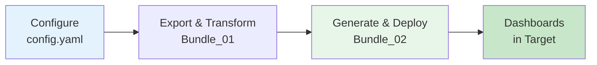
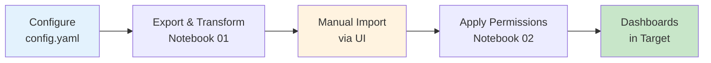

# Databricks Lakeview Dashboard Migration

Modular, configuration-driven solution for migrating Databricks Lakeview dashboards between workspaces with automated catalog/schema transformations and permissions preservation.

## Overview

This solution provides **two migration approaches**:

1. **Bundle Approach (Recommended)** - Uses Databricks Asset Bundles for infrastructure-as-code deployment
2. **Manual Approach** - Traditional workflow with manual import and ACL application

Both approaches use a **modular architecture** with:
- Single configuration file (`config/config.yaml`)
- Reusable Python helper modules (`helpers/`)
- Simplified notebooks (2 per approach vs. original 5)
- Fixed transformation logic (regex-based, not simple string replace)

---

## Quick Start

### Option 1: Bundle Approach (Recommended)

**Best for:** Production deployments, version control, CI/CD pipelines



**Steps:**
1. Edit `config/config.yaml` with your workspace details
2. Run `Bundle/Bundle_01_Export_and_Transform.ipynb`
3. Run `Bundle/Bundle_02_Generate_and_Deploy.ipynb`
4. Verify dashboards in target workspace

**See:** [Bundle/README.md](Bundle/README.md) for detailed instructions

### Option 2: Manual Approach

**Best for:** Testing, small migrations, learning the workflow



**Steps:**
1. Edit `config/config.yaml` with your workspace details
2. Run `notebooks/01_Export_and_Transform.ipynb`
3. Manually import `.lvdash.json` files via Databricks UI
4. Run `notebooks/02_Apply_Permissions.ipynb`

**See:** [TESTING_GUIDE.md](TESTING_GUIDE.md) for detailed instructions

---

## Project Structure

```
dashboard-migration/
├── config/
│   ├── config.yaml                    # Edit this for your environment
│   └── config_example.yaml            # Template with documentation
│
├── helpers/                            # Reusable Python modules
│   ├── auth.py                        # Workspace authentication
│   ├── discovery.py                   # Dashboard discovery
│   ├── export.py                      # Dashboard export
│   ├── transform.py                   # Catalog/schema transformation
│   ├── permissions.py                 # ACL management
│   ├── bundle_generator.py            # Bundle generation
│   └── volume_utils.py                # Volume operations
│
├── Bundle/                             # Bundle approach (recommended)
│   ├── Bundle_01_Export_and_Transform.ipynb
│   ├── Bundle_02_Generate_and_Deploy.ipynb
│   └── README.md
│
├── notebooks/                          # Manual approach
│   ├── 01_Export_and_Transform.ipynb
│   └── 02_Apply_Permissions.ipynb
│
├── TESTING_GUIDE.md                   # Comprehensive testing guide
├── START_HERE.md                      # Overview of solution
├── README_MODULAR.md                  # Architecture details
├── DATABRICKS_REPOS_SETUP.md          # Repos setup guide
└── catalog_schema_mapping_template.csv # CSV template
```

---

## Features

**Core Capabilities:**
- Migrate Lakeview dashboards between workspaces
- Transform catalog/schema/table references via CSV mappings
- Preserve and restore dashboard permissions (best-effort)
- Support multiple authentication methods (OAuth, PAT, Service Principal)

**Modular Architecture:**
- Single configuration file for all settings
- Reusable helper modules (no code duplication)
- Two deployment options (Bundle vs Manual)
- Simplified notebooks (2 instead of 5)

**Bundle Approach Benefits:**
- Infrastructure-as-code (declarative YAML)
- Version control friendly
- Automated deployment with validation
- CI/CD pipeline ready

**Manual Approach Benefits:**
- Simpler workflow for testing
- More control over import process
- Better for learning and debugging
- No CLI dependencies

---

## Approach Comparison

| Factor | Bundle Approach | Manual Approach |
|--------|----------------|-----------------|
| **Setup complexity** | Medium (CLI required) | Low (UI-based) |
| **Deployment** | Automated | Manual import |
| **Version control** | Yes (declarative YAML) | No |
| **CI/CD ready** | Yes | No |
| **Best for** | Production, teams | Testing, learning |
| **Permissions** | Applied automatically | Applied via notebook |
| **Validation** | Built-in CLI validation | Manual verification |
| **Rollback** | `databricks bundle destroy` | Manual deletion |

---

## Prerequisites

**Required:**
- Access to source and target Databricks workspaces
- Permissions to create Unity Catalog volumes
- Databricks Runtime 11.3 LTS or higher
- One of: OAuth (`az login`), Service Principal, or PAT tokens

**For Bundle Approach:**
- Databricks CLI installed and configured
- `databricks bundle` command available

**For Manual Approach:**
- Access to Databricks workspace UI

---

## Authentication

Configure in `config/config.yaml`:

### OAuth (Recommended)

```yaml
auth:
  method: "oauth"
  # No additional config needed - uses notebook authentication
```

**Best for:** Interactive use, development, most scenarios

### Service Principal

```yaml
auth:
  method: "service_principal"
  service_principal:
    client_id_scope: "migration"
    client_id_key: "sp-client-id"
    client_secret_scope: "migration"
    client_secret_key: "sp-secret"
    tenant_id_scope: "migration"
    tenant_id_key: "sp-tenant"
```

**Best for:** Production, CI/CD, automation

### PAT Tokens

```yaml
auth:
  method: "pat"
  pat:
    secret_scope: "migration"
    secret_key: "source-token"
```

**Best for:** Quick tests, development

---

## Getting Started

### Step 1: Setup

1. **Clone or sync this repository to Databricks**
   - See [DATABRICKS_REPOS_SETUP.md](DATABRICKS_REPOS_SETUP.md) for Repos setup
   - Or manually upload files to workspace

2. **Edit configuration**
   - Copy `config/config_example.yaml` to `config/config.yaml`
   - Update workspace URLs, authentication, paths

3. **Create secrets (if using PAT or Service Principal)**
   ```python
   dbutils.secrets.createScope(scope="migration")
   dbutils.secrets.put(scope="migration", key="source-token", string_value="...")
   ```

4. **Create Unity Catalog volume**
   ```sql
   CREATE VOLUME IF NOT EXISTS catalog.schema.dashboard_migration;
   ```

5. **Create CSV mapping file**
   - Edit `catalog_schema_mapping_template.csv`
   - Upload to volume at path specified in config

### Step 2: Choose Your Approach

**For Bundle Approach:**
- Follow [Bundle/README.md](Bundle/README.md)
- Run `Bundle_01` then `Bundle_02`

**For Manual Approach:**
- Follow [TESTING_GUIDE.md](TESTING_GUIDE.md)
- Run `01_Export_and_Transform`, manual import, then `02_Apply_Permissions`

### Step 3: Test and Verify

1. Check dashboards imported to target workspace
2. Verify catalog/schema names updated correctly
3. Test dashboard queries run successfully
4. Confirm permissions applied correctly

---

## Documentation

- **[START_HERE.md](START_HERE.md)** - Overview of the solution and what was done
- **[TESTING_GUIDE.md](TESTING_GUIDE.md)** - Comprehensive step-by-step testing guide
- **[README_MODULAR.md](README_MODULAR.md)** - Detailed architecture documentation
- **[QUICKSTART_MODULAR.md](QUICKSTART_MODULAR.md)** - Quick reference guide
- **[Bundle/README.md](Bundle/README.md)** - Bundle approach specific documentation
- **[DATABRICKS_REPOS_SETUP.md](DATABRICKS_REPOS_SETUP.md)** - Setup Databricks Repos

---

## Troubleshooting

**Common Issues:**

1. **"Module not found: helpers"**
   - Ensure `helpers/` folder is in the same directory as notebooks
   - Add `sys.path.insert(0, '../helpers')` at top of notebook

2. **"Config file not found"**
   - Verify `config/config.yaml` exists
   - Check path in notebook: `load_config('../config/config.yaml')`

3. **"Dashboard not found in inventory"**
   - Check `dashboard_selection` method in config
   - Verify catalog name or dashboard IDs are correct

4. **"Transformation not working"**
   - Verify CSV mapping file path in config
   - Check CSV has correct old_catalog/old_schema/new_catalog/new_schema columns
   - Ensure no extra spaces in CSV values

5. **"Bundle validation failed"**
   - Run `databricks bundle validate` in bundle directory
   - Check `databricks.yml` syntax
   - Verify warehouse name exists in target

**For more troubleshooting:** See [TESTING_GUIDE.md](TESTING_GUIDE.md) - Troubleshooting section

---

## Support and Contributing

**Questions or Issues?**
- Review documentation files (especially TESTING_GUIDE.md)
- Check helper module source code for function details
- Verify configuration settings in config.yaml

**Customization:**
- Helper modules are designed to be extended
- Add custom discovery methods in `helpers/discovery.py`
- Add custom transformations in `helpers/transform.py`
- Modify bundle generation logic in `helpers/bundle_generator.py`

---

**Version:** 2.0 (Modular)  
**Last Updated:** January 2026  
**Compatible with:** Databricks Runtime 11.3 LTS+
