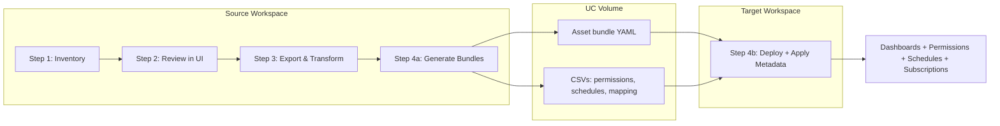

# Databricks Dashboard Migration Toolkit

Migrate Databricks Lakeview dashboards across workspaces with catalog/schema transformations, **permission and schedule migration**, and cross-workspace authentication via Service Principal OAuth or PAT tokens. Fully deployable with Databricks Asset Bundles (DABs).

**Why this toolkit instead of Terraform?** Terraform's Databricks provider doesn't support Lakeview dashboard migration, cross-workspace catalog remapping, or automatic permissions/schedule preservation. See [WHY_THIS_TOOLKIT.md](WHY_THIS_TOOLKIT.md) for a full comparison, decision guide, and Mermaid diagrams.

---

## Migration Workflow at a Glance



**In short:** Steps 1–3 run on the source workspace and write CSVs + transformed definitions to a UC Volume. Step 4a generates the deployable bundle; Step 4b deploys to the target and applies permissions, schedules, and subscriptions automatically (no extra flags).

---

## Project Structure

```
dashboard-migration/
  databricks.yml                  # Bundle config: variables, targets, include
  resources/
    migration_jobs.yml             # DAB job definitions (migration jobs)
  src/
    notebooks/                    # Migration notebooks (Steps 1-4)
      Bundle_01_Inventory_Generation.ipynb
      Bundle_02_Review_and_Approve_Inventory.ipynb
      Bundle_03_Export_and_Transform.ipynb
      Bundle_04_Generate_and_Deploy.ipynb
      Bundle_04_Generate_and_Deploy_V2.ipynb
      Bundle_IP_ACL_Setup.ipynb
    helpers/                     # Python modules (auth, export, transform, deploy)
    setup-guides/                 # SP OAuth setup doc + secrets verification notebook
      Setup_Migration_Secrets.ipynb
      SP_OAUTH_SETUP.md
  scripts/                        # Shell scripts
    apply_metadata.sh              # Applies permissions, schedules, subscriptions after deploy
    deploy_asset_bundle.sh         # Step 4b: deploy bundle + run apply_metadata.sh
    auto_setup_ip_acl.sh
    cleanup_ip_acl.sh
  ip-detection/                   # Sub-bundle for cluster IP detection
  SETUP.md                        # Full setup and usage guide
  PREREQUISITES_CHECKLIST.md      # Pre-flight checklist before migration
```

---

## Prerequisites

- **Databricks CLI** v0.218.0+ installed
- Two CLI profiles in `~/.databrickscfg` (source and target workspaces)
- Workspace admin (or sufficient permissions) on source and target
- **Unity Catalog volume** for migration artifacts
- **SQL warehouse** in target workspace
- **Target tables exist** in target catalog/schema (dashboards reference them)
- For Step 4: **Service Principal with OAuth** (recommended) or a PAT token

For a full pre-flight checklist, see [PREREQUISITES_CHECKLIST.md](PREREQUISITES_CHECKLIST.md).

---

## Quick Start

```bash
# 1. Clone
git clone https://github.com/archana-krishnamurthy_data/dashboard-migration.git
cd dashboard-migration

# 2. Configure — edit databricks.yml with your workspace URLs, catalog, volume, warehouse
#    (keep changes local; do not commit real values)

# 3. Deploy (one-time)
databricks bundle deploy -t <target> --profile <source-profile>

# 4. Run migration steps 1–4
databricks bundle run inventory_generation -t <target> --profile <source-profile>
# Step 2: open Bundle_02 in UI, review, type CONFIRM to save approved inventory
databricks bundle run export_transform -t <target> --profile <source-profile>
databricks bundle run generate_deploy -t <target> --var="dry_run_mode=false" --profile <source-profile>

# 5. Deploy to target and apply permissions, schedules, subscriptions (Step 4b)
./scripts/deploy_asset_bundle.sh \
  --source-profile <source-profile> \
  --target-profile <target-profile> \
  --volume-base /Volumes/<catalog>/<schema>/dashboard_migration
```

**For full setup (including SP OAuth and troubleshooting), see [SETUP.md](SETUP.md).**

---

## Migration Workflow (Steps in Detail)

| Step | What | How |
|------|------|-----|
| **1** | Generate inventory | `databricks bundle run inventory_generation -t <target> --profile <source-profile>` |
| **2** | Review and approve (UI) | Open `Bundle_02` in workspace; review, filter, type **CONFIRM** to save |
| **3** | Export and transform | `databricks bundle run export_transform -t <target> --profile <source-profile>` |
| **4a** | Generate bundles | `databricks bundle run generate_deploy -t <target> --var="dry_run_mode=false" --profile <source-profile>` |
| **4b** | Deploy to target + apply metadata | `./scripts/deploy_asset_bundle.sh --source-profile <src> --target-profile <tgt> --volume-base <path>` |

> **Note:** Step 4b deploys dashboards via the asset bundle, then runs `scripts/apply_metadata.sh` to apply **permissions**, **schedules**, and **subscriptions** from the CSVs. No extra flags are required; the script is idempotent (safe to re-run).

### What Gets Applied in Step 4b

```
┌─────────────────────────────────────────────────────────────────────────────┐
│  Step 4b (deploy_asset_bundle.sh → apply_metadata.sh)                          │
├─────────────────────────────────────────────────────────────────────────────┤
│  ✅ Dashboards       — from asset bundle YAML                                 │
│  ✅ Permissions      — from all_permissions.csv (users, groups, levels)      │
│  ✅ Schedules        — from all_schedules.csv (cron, timezone, pause status) │
│  ✅ Subscriptions    — from schedule/subscriber data (email notifications)   │
│  All applied by default; idempotent (skips what already exists).              │
└─────────────────────────────────────────────────────────────────────────────┘
```

---

## Setup (Summary)

### 1. Clone the repo

```bash
git clone https://github.com/archana-krishnamurthy_data/dashboard-migration.git
cd dashboard-migration
```

### 2. Configure `databricks.yml`

Edit `databricks.yml` for your target (e.g. `dev` or `azure-test`):

| Variable | Example |
|----------|---------|
| `catalog` | `my_catalog` |
| `volume_base` | `/Volumes/my_catalog/my_schema/dashboard_migration` |
| `source_workspace_url` | `https://source.cloud.databricks.com` |
| `target_workspace_url` | `https://target.cloud.databricks.com` |
| `warehouse_id` or `warehouse_name` | Target SQL warehouse |
| `auth_method` | `"sp_oauth"` (recommended) or `"pat"` |
| `sp_secret_scope` | `"migration_secrets"` |

Set `workspace.host` to your **source** workspace URL.

### 3. Service Principal OAuth (recommended for Step 4)

When `auth_method: "sp_oauth"`:

1. Create a Service Principal in Account Console (User management → Service principals).
2. Add the SP to both source and target workspaces.
3. Generate an OAuth secret for the SP; save Client ID and secret.
4. Store credentials in the source workspace secret scope:

```bash
databricks secrets create-scope migration_secrets --profile <source-profile>
databricks secrets put-secret migration_secrets sp_client_id --profile <source-profile>
databricks secrets put-secret migration_secrets sp_client_secret --profile <source-profile>
```

See [src/setup-guides/SP_OAUTH_SETUP.md](src/setup-guides/SP_OAUTH_SETUP.md) for the full guide.

### 4. Deploy the bundle (one-time)

```bash
databricks bundle deploy -t <target> --profile <source-profile>
```

### 5. (Optional) Verify secrets

Open [Setup_Migration_Secrets.ipynb](src/setup-guides/Setup_Migration_Secrets.ipynb) in the workspace and run the config and verify cells.

---

## Running the Migration (Steps 1–4)

### Step 1: Generate inventory

```bash
databricks bundle run inventory_generation -t <target> --profile <source-profile>
```

### Step 2: Manual review and approval (UI)

Open [Bundle_02_Review_and_Approve_Inventory.ipynb](src/notebooks/Bundle_02_Review_and_Approve_Inventory.ipynb) in the Databricks workspace. Review dashboards, apply filters, type **CONFIRM** to save the approved inventory.

### Step 3: Export and transform

```bash
databricks bundle run export_transform -t <target> --profile <source-profile>
```

### Step 4a: Generate bundles

```bash
# Dry run (preview only)
databricks bundle run generate_deploy -t <target> --profile <source-profile>

# Live (writes bundle + CSVs to volume)
databricks bundle run generate_deploy -t <target> --profile <source-profile> \
  --var="dry_run_mode=false"
```

### Step 4b: Deploy to target and apply metadata

```bash
./scripts/deploy_asset_bundle.sh \
  --source-profile <source-profile> \
  --target-profile <target-profile> \
  --volume-base /Volumes/<catalog>/<schema>/dashboard_migration
```

This downloads the bundle from the volume, deploys dashboards to the target, then runs `apply_metadata.sh` to apply permissions, schedules, and subscriptions. No extra parameters are needed for normal use.

---

## Verification Checklist

After setup or config changes:

1. **Validate bundle:** `databricks bundle validate -t <target>`
2. **Deploy:** `databricks bundle deploy -t <target> --profile <source-profile>`
3. **Run jobs:** inventory_generation, export_transform, generate_deploy — confirm no `ModuleNotFoundError`
4. **Bundle_02 in UI:** Run path cell and cells that import helpers
5. **Setup_Migration_Secrets.ipynb:** Run config, path, verify, and test connection (if using SP OAuth)

---

## Key Design Decisions

- **Structure:** All code under `src/`; DAB resources in `resources/`; config and targets in root `databricks.yml`
- **Single source of truth:** All configuration and target overrides in `databricks.yml`
- **No secrets in repo:** Workspace URLs, catalogs, and credentials stay local or in Databricks secret scopes
- **`include:` pattern:** Root `databricks.yml` includes `resources/*.yml` for separation of config vs job definitions
- **Metadata by default:** Step 4b applies permissions, schedules, and subscriptions automatically and idempotently

---

## Git Guidelines

- Do **not** commit real workspace URLs, catalog names, warehouse IDs, or secrets.
- The committed `databricks.yml` uses placeholders; override locally only.
- Keep `auth_method`, `sp_secret_scope`, and generic names in the repo (e.g. `migration_secrets`).
- Store `sp_client_id` and `sp_client_secret` via CLI only, never in code.

---

## New User Flow

1. **Clone** the repo.
2. **Create** a Service Principal in Account Console; add to both workspaces; generate an OAuth secret.
3. **Configure** `databricks.yml` locally (catalog, volume_base, source/target URLs, warehouse, auth_method).
4. **Store** SP credentials via CLI (`create-scope`, `put-secret sp_client_id`, `put-secret sp_client_secret`).
5. **Deploy** once: `databricks bundle deploy -t <target> --profile <source-profile>`.
6. **Run** Steps 1–4 in order; use Step 4b to deploy to target and apply all metadata.

---

## Troubleshooting

| Error | Cause | Fix |
|-------|-------|-----|
| `ModuleNotFoundError: No module named 'helpers'` | `sys.path` missing `src/` | Run the path-resolution cell at the top of the notebook |
| `Missing secrets: ['sp_client_id', 'sp_client_secret']` | Secrets not in scope | Run `databricks secrets put-secret` for both keys |
| `Secret scope does not exist` | Scope not created | `databricks secrets create-scope migration_secrets --profile <source-profile>` |
| `401 Unauthorized` on target | SP OAuth secret invalid or expired | Regenerate in Account Console; re-store via CLI |
| `403 Forbidden` on target | SP lacks workspace permissions | Add SP to target workspace in Account Console |
| `apply_metadata.sh not found` | Script missing (e.g. on old branch) | Use branch `main` or `exemplar-cleanup`; Step 4b still deploys dashboards but skips metadata |
| Wrong workspace | Incorrect URL in yml | Verify `target_workspace_url` and `workspace.host` |

---

## Resources

| Resource | Description |
|----------|-------------|
| [PREREQUISITES_CHECKLIST.md](PREREQUISITES_CHECKLIST.md) | Pre-flight checklist before migration |
| [SETUP.md](SETUP.md) | Full setup, SP OAuth, deploy, run, troubleshoot |
| [WHY_THIS_TOOLKIT.md](WHY_THIS_TOOLKIT.md) | Why this toolkit vs Terraform (comparison, decision guide, Mermaid diagrams) |
| [src/setup-guides/SP_OAUTH_SETUP.md](src/setup-guides/SP_OAUTH_SETUP.md) | Detailed SP OAuth guide |
| [src/setup-guides/Setup_Migration_Secrets.ipynb](src/setup-guides/Setup_Migration_Secrets.ipynb) | Verify secrets and test connection |
| [scripts/](scripts/) | `apply_metadata.sh`, `deploy_asset_bundle.sh`, IP ACL scripts |
| [ip-detection/](ip-detection/) | Sub-bundle for cluster IP detection (IP ACL whitelisting) |
