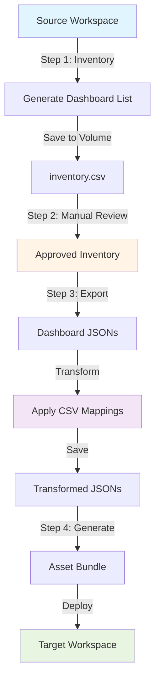
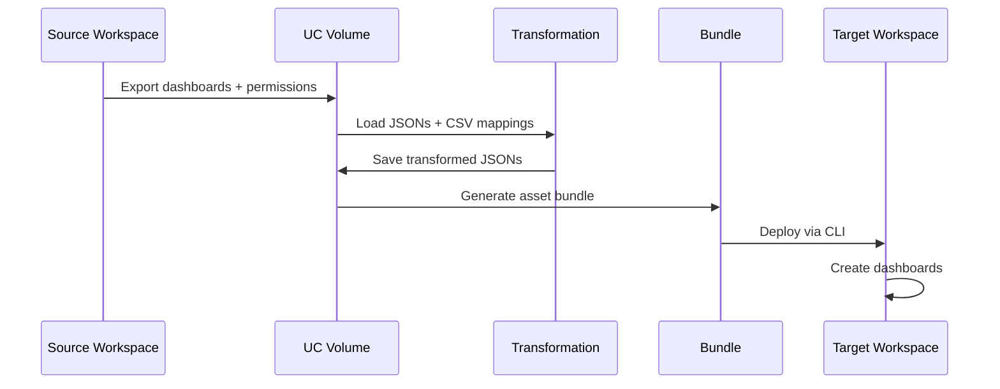

# Databricks Dashboard Migration Toolkit

**Created by Archana Krishnamurthy, Sr Delivery Solutions Architect, Databricks**

Complete solution for migrating Databricks Lakeview dashboards across workspaces with catalog/schema transformations.

> 📚 **Documentation:** All detailed guides and documentation are in the [`docs/`](docs/) folder. See [`docs/INDEX.md`](docs/INDEX.md) for a complete index.

## 🎯 Features

- ✅ **Automated Discovery**: System table queries for dashboard inventory
- ✅ **Catalog Transformation**: Remap catalog.schema.table references via CSV
- ✅ **Permission Migration**: Capture and apply ACLs
- ✅ **Multi-Environment**: Dev, staging, prod configurations
- ✅ **Serverless & Standard Clusters**: Compatible with both
- ✅ **Asset Bundle Deployment**: Full DAB support for production workflows

## 📋 Prerequisites

**Quick Checklist:**
- ✅ Databricks CLI v0.218.0+ installed on LOCAL MACHINE
- ✅ CLI profiles configured in `~/.databrickscfg` (see below)
- ✅ Workspace Admin access on source and target workspaces
- ✅ Unity Catalog volume for storing artifacts
- ✅ SQL warehouse in target workspace
- ✅ Cross-workspace authentication configured (PAT token or Service Principal)
- ✅ Secret scope created for credentials

### ⚡ Quick CLI Setup (5 minutes)

**LOCAL MACHINE SETUP** - Run these commands in your Mac/Windows terminal:

```bash
# 1. Install CLI (if not installed)
pip install databricks-cli --upgrade
databricks --version  # Must be >= 0.218.0

# 2. Configure profiles (edit ~/.databrickscfg)
# See CLI_SETUP_QUICKREF.md for your specific configuration

# 3. Test profiles
databricks workspace list --profile source-workspace
databricks workspace list --profile target-workspace

# 4. Create secret scope
databricks secrets create-scope migration_secrets --profile source-workspace
databricks secrets put-secret migration_secrets target_workspace_token --profile source-workspace
```

**📖 Complete Setup Guides:**
- **[`CLI_SETUP_QUICKREF.md`](CLI_SETUP_QUICKREF.md)** - Quick reference for YOUR specific workspaces ⭐
- **[`PREREQUISITES_AND_SETUP.md`](PREREQUISITES_AND_SETUP.md)** - Detailed setup with Service Principal, permissions, etc.
- **[`TESTING_GUIDE.md`](TESTING_GUIDE.md)** - Step-by-step testing for both deployment methods

## 🏗️ Architecture

### Migration Flow



### Data Flow



## 🚀 Quick Start

### 1. Configure Your Environment

Edit `databricks.yml` target configuration:

```yaml
targets:
  dev:
    workspace:
      host: https://your-workspace.cloud.databricks.com
    variables:
      catalog: your_source_catalog
      volume_base: /Volumes/catalog/schema/volume
      source_workspace_url: https://source-workspace.cloud.databricks.com
      target_workspace_url: https://target-workspace.cloud.databricks.com
      warehouse_name: your_warehouse
```

### 2. Create Catalog Mapping CSV

Create `/Volumes/catalog/schema/volume/mappings/catalog_schema_mapping.csv`:

```csv
old_catalog,old_schema,old_table,new_catalog,new_schema,new_table,old_volume,new_volume
dev_catalog,bronze,customers,prod_catalog,gold,customers,,
dev_catalog,bronze,,prod_catalog,gold,,,
```

### 3. Run Migration

```bash
cd "Customer-Work/Catalog Migration"
export DATABRICKS_CONFIG_PROFILE=your-profile

# Step 1: Generate inventory
databricks bundle deploy -t dev
databricks bundle run inventory_generation -t dev

# Step 2: Review inventory (open Bundle_02 in Databricks UI)

# Step 3: Export & transform
databricks bundle run export_transform -t dev

# Step 4: Generate & deploy
databricks bundle run generate_deploy -t dev
```

## 📚 Workflow Steps

### Step 1: Inventory Generation

**Notebook**: `Bundle/Bundle_01_Inventory_Generation.ipynb`

Discovers all dashboards in source workspace and generates inventory CSV.

**What it does:**
- Queries system tables for dashboard metadata
- Enriches with audit data (usage, creators, etc.)
- Exports to `dashboard_inventory/inventory.csv`

**Run:**
```bash
databricks bundle run inventory_generation -t dev
```

### Step 2: Manual Review & Approval

**Notebook**: `Bundle/Bundle_02_Review_and_Approve_Inventory.ipynb`

Interactive review process to approve which dashboards to migrate.

**What it does:**
- Displays inventory with filters
- Allows selection/deselection
- Saves approved list to `dashboard_inventory_approved/inventory.csv`

**Run:**
Open notebook in Databricks UI and follow instructions.

### Step 3: Export & Transform

**Notebook**: `Bundle/Bundle_03_Export_and_Transform.ipynb`

Exports approved dashboards and applies catalog transformations.

**What it does:**
- Exports dashboard JSONs from source
- Captures permissions (ACLs)
- Applies CSV mappings to transform catalog references
- Fixes display names (removes ID prefixes)
- Saves to `exported/` and `transformed/` directories

**Run:**
```bash
databricks bundle run export_transform -t dev
```

### Step 4: Generate & Deploy

**Notebook**: `Bundle/Bundle_04_Generate_and_Deploy.ipynb`

Deploys dashboards to target workspace with **two deployment method options**:

#### Deployment Method Options

| Feature | SDK Direct (Default) | Asset Bundle + SDK |
|---------|----------------------|---------------------|
| **Deployment** | Direct API calls | Bundle → SDK |
| **Dashboards** | ✅ SDK | ✅ Bundle |
| **Permissions** | ✅ SDK (immediate) | ✅ Bundle |
| **Schedules** | ✅ SDK (immediate) | ✅ SDK (post-bundle) |
| **Subscriptions** | ✅ SDK (immediate) | ✅ SDK (post-bundle) |
| **Local Download** | ❌ None | ❌ None (stays in UC volume) |
| **Automation** | ✅ Fully automated | ✅ Fully automated |
| **100+ Dashboards** | ✅ Yes | ✅ Yes |
| **GitOps/IaC** | ⚠️ API-based | ✅ Bundle artifacts |
| **Workspace Management** | ⚠️ No bundle | ✅ Bundle resources |
| **Complexity** | 🟢 Simple | 🟡 Medium |
| **Best For** | General migrations | IaC workflows |

**1. SDK Direct (Recommended - Default)**
- Deploys dashboards directly via Databricks SDK API
- Fully automated - no local downloads required
- Handles ALL metadata in one pass (dashboards, permissions, schedules, subscriptions)
- **Best for:** Simple migrations, 100+ dashboards, full automation, quickest path

**2. Asset Bundle + SDK**
- Creates Databricks Asset Bundle with dashboard definitions
- Deploys dashboards and permissions via bundle (stays in UC volume, no local download)
- Applies schedules/subscriptions via SDK (bundles don't natively support these)
- **Best for:** Infrastructure-as-code workflows, GitOps, workspace resource tracking, team needs bundle artifacts

#### Configuration

In `databricks.yml`:
```yaml
variables:
  deployment_method: "sdk_direct"  # or "asset_bundle"
  dry_run_mode: "false"            # "true" for preview without deployment
  apply_permissions: "true"        # Apply ACLs
  apply_schedules: "true"          # Apply schedules/subscriptions
```

#### Run Options

**CLI Mode (Automated):**
```bash
# Deploy bundle (one-time setup)
databricks bundle deploy -t dev --profile source-workspace

# Dry run - preview only (default, safe)
databricks bundle run generate_deploy -t dev --profile source-workspace

# Live deploy - creates resources (explicit flag required)
databricks bundle run generate_deploy -t dev --var="dry_run_mode=false" --profile source-workspace

# Asset Bundle method (instead of SDK Direct)
databricks bundle run generate_deploy -t dev --var="deployment_method=asset_bundle" --profile source-workspace

# Asset Bundle + Live deploy
databricks bundle run generate_deploy -t dev \
  --var="deployment_method=asset_bundle" \
  --var="dry_run_mode=false" \
  --profile source-workspace
```

**Interactive Mode (Manual):**
1. Open `Bundle/Bundle_04_Generate_and_Deploy.ipynb` in Databricks UI
2. Select deployment method from dropdown widget
3. Choose dry run mode (true/false)
4. Run all cells

#### What it does:
- Loads transformed dashboards, permissions, schedules
- **If SDK Direct:**
  - Creates dashboards via API
  - Applies permissions immediately
  - Creates schedules and subscriptions
- **If Asset Bundle:**
  - Generates bundle structure in UC volume
  - Deploys dashboards and permissions via SDK (no local download)
  - Applies schedules and subscriptions via SDK
- Verifies deployment
- Generates summary report

## ⚙️ Compute Options

### Serverless (Default - Recommended) ✅

**Configuration**: Already enabled in `databricks.yml`

**Benefits:**
- ✅ Faster startup (no cluster provisioning)
- ✅ Auto-scaling
- ✅ No version management
- ✅ Handles dependencies automatically
- ✅ Direct volume path access (no `/dbfs` prefix issues)

**Use for:**
- All migration steps
- Development and testing
- Production deployments

**Status**: ✅ Fully compatible - all notebooks tested and working

### Standard Clusters (Optional)

**Configuration**: Uncomment in `databricks.yml`

**When to use:**
- Serverless not available in your region
- Need specific Spark configurations
- Performance testing

**Setup:**

1. In `databricks.yml`, uncomment for desired job:
```yaml
job_cluster_key: export_cluster
libraries:
  - pypi:
      package: "databricks-sdk>=0.18.0"

job_clusters:
  - job_cluster_key: export_cluster
    new_cluster:
      spark_version: "17.3.x-scala2.13"  # Latest LTS (Spark 4.0)
      node_type_id: "i3.xlarge"
      num_workers: 1
```

2. NumPy already pinned in notebooks for compatibility

### Comparison

| Feature | Serverless | Standard Cluster |
|---------|------------|------------------|
| Startup Time | ~30s | ~5-10min |
| Cost | Pay per second | Pay per hour (min 1hr) |
| Scaling | Automatic | Manual configuration |
| Dependencies | Auto-managed | Manual install |
| Volume Access | Direct `/Volumes/` | Direct `/Volumes/` or `/dbfs/Volumes/` |
| Best For | Migration tasks ✅ | Heavy compute |
| **Compatibility** | **✅ Fully tested** | **⚠️ Needs testing** |

## 🗂️ Project Structure

```
Catalog Migration/
├── databricks.yml           # Bundle configuration
├── helpers/                 # Python modules
│   ├── __init__.py
│   ├── auth.py             # Workspace authentication
│   ├── discovery.py        # Dashboard discovery
│   ├── export.py           # Dashboard export
│   ├── transform.py        # Catalog transformation
│   ├── permissions.py      # ACL management
│   ├── volume_utils.py     # UC volume operations
│   ├── bundle_generator.py # Asset bundle generation
│   └── config_loader.py    # Configuration utilities
├── Bundle/                  # Notebooks
│   ├── Bundle_01_Inventory_Generation.ipynb
│   ├── Bundle_02_Review_and_Approve_Inventory.ipynb
│   ├── Bundle_03_Export_and_Transform.ipynb
│   └── Bundle_04_Generate_and_Deploy.ipynb
├── catalog_schema_mapping_template.csv  # Example mapping
└── README.md               # This file
```

## 🔧 Configuration Reference

### databricks.yml Variables

| Variable | Description | Example |
|----------|-------------|---------|
| `catalog` | Source catalog to scan | `dev_catalog` |
| `volume_base` | Base path for artifacts | `/Volumes/cat/schema/vol` |
| `source_workspace_url` | Source workspace | `https://source.databricks.com` |
| `target_workspace_url` | Target workspace | `https://target.databricks.com` |
| `warehouse_name` | SQL warehouse | `migration_warehouse` |
| `transformation_enabled` | Enable catalog mapping | `true` |
| `mapping_csv_path` | Path to mapping CSV | `mappings/catalog_schema_mapping.csv` |
| `capture_permissions` | Capture ACLs from source | `true` |
| `apply_permissions` | Apply ACLs to target | `true` |
| `permissions_dry_run` | Preview permission changes | `false` |
| `capture_schedules` | Capture schedules/subscriptions | `true` |
| `apply_schedules` | Apply schedules/subscriptions | `true` |
| `schedules_dry_run` | Preview schedule changes | `false` |

### Catalog Mapping CSV Format

```csv
old_catalog,old_schema,old_table,new_catalog,new_schema,new_table,old_volume,new_volume
source_cat,schema1,table1,target_cat,schema2,table2,,
source_cat,schema1,,target_cat,schema2,,,
source_cat,,,target_cat,,,,
```

**Rules:**
- Empty `old_table` → maps entire schema
- Empty `old_schema` → maps entire catalog
- Volumes are optional (for path transformations)

## 🌍 Multi-Environment Setup

### Development
```bash
databricks bundle run export_transform -t dev
```

### Staging (after configuring)
```bash
databricks bundle run export_transform -t staging
```

### Production (after configuring)
```bash
databricks bundle run export_transform -t prod
```

See `databricks.yml` for environment-specific configurations.

## 🐛 Troubleshooting

### Config file not found error

**Error**: `Failed to load config from ../config/config.yaml`

**Solution**: Already fixed! All notebooks use parameters from `databricks.yml`. Re-deploy:
```bash
databricks bundle deploy -t dev
```

### NumPy version conflicts

**Error**: `NumPy 2.x cannot be run in NumPy 1.x`

**Solution**: Already fixed! Notebooks pin `numpy<2`. Use serverless or standard clusters.

### Multiple profiles error

**Error**: `multiple profiles matched`

**Solution**: Set profile:
```bash
export DATABRICKS_CONFIG_PROFILE=your-profile
```

### Permission errors

**Error**: `403 Invalid access token`

**Solution**: Re-authenticate:
```bash
databricks auth login --host https://your-workspace.cloud.databricks.com
```

### Schedule/subscription errors

**Error**: `Schedule creation failed` or `Subscription creation failed`

**Solution**: 
- Verify warehouse is accessible in target workspace
- Check that schedule cron expressions are valid
- Ensure user has permissions to create schedules
- Review original schedule configuration for compatibility
- Check that subscription email addresses/groups exist in target workspace
- Use `schedules_dry_run: "true"` to preview without creating

**Note**: Schedule/subscription errors don't block dashboard deployment. Dashboards will still be created successfully even if schedule application fails.

## 📊 What Gets Migrated

✅ **Included:**
- Dashboard structure and layout
- Datasets and queries
- Visualizations and filters
- Catalog/schema/table references (transformed)
- Permissions (ACLs)
- **Scheduled refreshes** (captured and applied automatically)
- **Subscriptions** (email/Slack/Teams - captured and applied automatically)
- Display names (cleaned)

❌ **Not Included:**
- Dashboard history/versions (not available via API)
- Comments and annotations (not available via API)

## 🔐 Cross-Workspace Authentication

When deploying dashboards from source to target workspace, the source cluster/compute needs network access to the target workspace API.

### Authentication Options

| Option | Setup Complexity | Security | Best For | Recommended |
|--------|------------------|----------|----------|-------------|
| **Service Principal (OAuth M2M)** | 🟡 Medium | ✅ High | Production, automation | ⭐ **Yes** |
| **PAT Token** | 🟢 Simple | ⚠️ Rotating required | Dev/test, quick setup | Acceptable |
| **Managed Identity (Azure)** | 🟡 Medium | ✅ High | Azure-native workloads | Yes (Azure) |

### Option 1: Service Principal OAuth M2M (Recommended)

The recommended approach using a Service Principal with OAuth M2M credentials.

**Benefits:**
- Credential-based security (not IP-dependent)
- Full audit trail (SP identity logged)
- Works with dynamic IPs and serverless
- Follows Databricks best practices

**Quick Setup:**

1. **Add SP to both workspaces** (Account Console UI):
   - Account Console → Workspaces → Source → Permissions → Add SP
   - Account Console → Workspaces → Target → Permissions → Add SP

2. **Create OAuth Secret** (Account Console UI):
   - Account Console → User Management → Service Principals → Your SP → Secrets → Generate

3. **Store credentials in secret scope**:
   ```bash
   databricks secrets create-scope migration_secrets --profile source-workspace
   databricks secrets put-secret migration_secrets sp_client_id --profile source-workspace
   databricks secrets put-secret migration_secrets sp_client_secret --profile source-workspace
   ```

4. **Enable in databricks.yml**:
   ```yaml
   variables:
     auth_method: "sp_oauth"
     sp_secret_scope: "migration_secrets"
   ```

**Full Guide:** See [`docs/SP_OAUTH_SETUP.md`](docs/SP_OAUTH_SETUP.md) for complete setup instructions.

### Option 2: PAT Token (Simple)

For quick setup or development environments, use a Personal Access Token.

**Setup:**
1. Generate PAT in **target** workspace (User Settings → Developer → Access Tokens)
2. Store in secret scope on **source** workspace:
   ```bash
   databricks secrets put-secret migration_secrets target_workspace_token --profile source-workspace
   ```

3. Configure in databricks.yml:
   ```yaml
   variables:
     auth_method: "pat"
     target_workspace_secret_scope: "migration_secrets"
   ```

### IP Whitelisting for Cross-Workspace Access

If the **target workspace has IP access lists enabled**, you must whitelist the source workspace's egress IP.

#### Option 1: Automated IP Detection (Recommended)

Use the provided scripts to auto-detect and whitelist:

```bash
cd "Customer-Work/Catalog Migration"

# Auto-detect source IP and whitelist on target
./scripts/auto_setup_ip_acl.sh

# After migration validation, cleanup the IP entry
./scripts/cleanup_ip_acl.sh
```

See [`docs/CLI_BEST_PRACTICES.md`](docs/CLI_BEST_PRACTICES.md) for detailed CLI reference.

#### Option 2: Manual IP Identification (No Code Required)

**For AWS Workspaces:**
- Check NAT Gateway public IP in AWS Console → VPC → NAT Gateways
- The public IP bound to your workspace's NAT Gateway is your egress IP

**For Azure Workspaces:**
- Look at the public IP(s) bound to your **NAT Gateway** that's attached to both workspace subnets
- This is your stable egress IP for classic compute
- Azure Portal → NAT Gateways → Select your gateway → Public IP addresses

**For GCP Workspaces:**
- Check Cloud NAT configuration for your workspace VPC
- GCP Console → Network Services → Cloud NAT → IP addresses

#### Option 3: Query from Cluster

Run this in a notebook on the source workspace:
```python
import requests
ip = requests.get('https://api.ipify.org').text
print(f"Cluster Egress IP: {ip}")
```

### IP Access List Configuration

After identifying your egress IP, add it to the target workspace:

**Via CLI:**
```bash
databricks ip-access-lists create \
  --label "source-workspace-cluster" \
  --list-type ALLOW \
  --ip-addresses "YOUR.IP.HERE/32" \
  --profile target-workspace
```

**Via UI:**
Target Workspace → Settings → Security → IP Access Lists → Add

## 🔒 Security Considerations

- **Credentials**: Never commit to git. Use Databricks profiles.
- **Permissions**: Test with `permissions_dry_run: "true"` first
- **Catalog Access**: Ensure target catalog exists and is accessible
- **Warehouse Access**: Target warehouse must be accessible to deploying user
- **Volume Access**: Requires READ/WRITE on UC volume
- **IP Whitelisting**: If target has IP ACLs enabled, whitelist source egress IP

## 📝 Best Practices

1. **Test in dev first** - Always validate in development environment
2. **Review inventory** - Use Step 2 to exclude test dashboards
3. **Verify mappings** - Check CSV has correct catalog names
4. **Small batches** - Migrate 10-20 dashboards at a time initially
5. **Backup source** - Export dashboards before transformation
6. **Validate data** - Check dashboards load correctly in target
7. **Document changes** - Keep track of what was migrated when

## 🎓 Advanced Topics

### Custom Transformations

Edit `helpers/transform.py` to add custom transformation logic:

```python
def custom_transformation(dashboard_json: str) -> str:
    data = json.loads(dashboard_json)
    # Your custom logic here
    return json.dumps(data)
```

### Batch Processing

Modify inventory CSV to process dashboards in batches:

```python
# In Bundle_03, modify to process only certain rows
inventory_df = inventory_df[inventory_df['batch'] == 1]
```

### Permission Mapping

Create custom permission mappings in `helpers/permissions.py`:

```python
def map_permissions(source_acl):
    # Map dev groups to prod groups
    return transformed_acl
```

## 🆘 Support

- Check troubleshooting section above
- Review error logs in Databricks job runs
- Consult documentation in `Bundle/` directory

---

**Version**: 2.0.0  
**Last Updated**: January 31, 2026  
**Status**: Production Ready ✅
