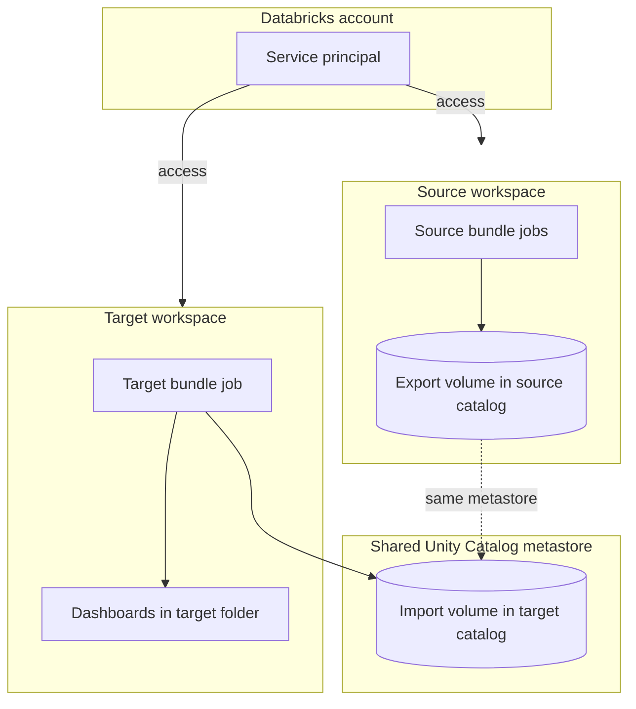
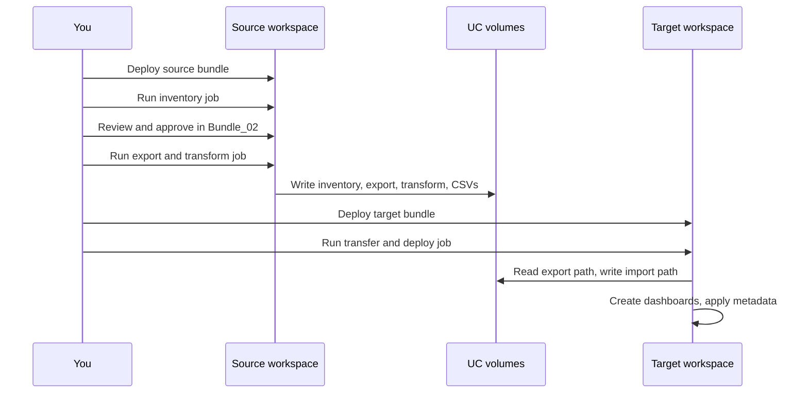

# Lakeview dashboard migration toolkit

Move **Databricks Lakeview (AI/BI) dashboards** from a **source workspace** to a **target workspace** while keeping **permissions**, **schedules**, and **subscriptions** aligned with your new **catalog and schema** names.

This toolkit uses **two Databricks Asset Bundles**: you deploy and run the **source** bundle only in the source workspace, and the **target** bundle only in the target workspace. A **shared Unity Catalog metastore** (and volumes under it) carries the files between workspaces—no cross-workspace passwords in the notebooks for the main path.

**Who this is for:** Teams doing workspace consolidation, environment promotion (e.g. non-prod → prod), or catalog changes where dashboards must be recreated in a new workspace with updated table references.

---

## What you get

| Output | Description |
|--------|-------------|
| **Inventory** | List of dashboards to migrate (you review and approve in the UI). |
| **Export + transform** | Dashboard definitions plus metadata written to a Unity Catalog **export volume**. |
| **Transfer + install** | In the target workspace, files are copied to an **import volume**, then dashboards are created under your chosen **workspace folder**. |
| **Optional mapping** | Catalog/schema/table rewrites driven by a mapping file on the volume when transformation is enabled. |

**Out of scope for Terraform:** Lakeview objects, cross-workspace dashboard install, and rich schedule/subscription metadata are not covered by the Databricks Terraform provider the same way—this toolkit is built for that gap. See [WHY_THIS_TOOLKIT.md](WHY_THIS_TOOLKIT.md) for a comparison.

---

## How it fits together (two workspaces)



**Typical roles**

- **Humans** use **two CLI profiles** (or OAuth logins)—one for source, one for target.
- **Automation** uses a **service principal** that is added to **both** workspaces and granted Unity Catalog rights on the export volume (source catalog) and import volume (target catalog), plus use of the target **SQL warehouse** and permissions on the **target folder** for dashboards.

---

## End-to-end workflow



---

## Quick start (two workspaces)

**Prerequisites (short):**

1. Databricks CLI v0.218+ with **two profiles** (source and target)
2. Source and target catalogs on the **same UC metastore**
3. Target **SQL warehouse** and target **tables** matching transformed references
4. Admin or sufficient rights on both workspaces

**Volumes and files to create:**

| What | When to create | How |
|------|----------------|-----|
| **Export volume** (source catalog) | Before running the Inventory job | `CREATE VOLUME IF NOT EXISTS <source_catalog>.<source_schema>.<export_volume>;` in the **source** workspace |
| **Import volume** (target catalog) | **Automatic** — the Transfer & Deploy job creates it | No action needed; the Transfer notebook runs `CREATE VOLUME IF NOT EXISTS` |
| **Mapping CSV** | Before running Export & Transform, if `transformation_enabled` is `"true"` | Create from the template (`catalog_schema_mapping_template.csv`), then upload: `databricks fs cp catalog_schema_mapping.csv dbfs:/Volumes/<source_catalog>/<source_schema>/<export_volume>/mappings/catalog_schema_mapping.csv --profile <source-profile>` |

See [PREREQUISITES_CHECKLIST.md](PREREQUISITES_CHECKLIST.md) for the full checklist with SQL and CLI commands.

### 1. Clone and configure locally

```bash
git clone https://github.com/YOUR_ORG/dashboard-migration.git
cd dashboard-migration
```

Edit the `databricks.yml` in each bundle folder with your values. Each file has a clearly marked **EDIT HERE** section at the bottom — replace the placeholder values with your workspace URL, CLI profile, catalog, schema, volume, and warehouse details.

```bash
# Edit these two files:
source/databricks.yml   # Source workspace: host, profile, catalog, volume_base
target/databricks.yml   # Target workspace: host, profile, catalogs, schemas, volumes, warehouse_id, target folder
```

See [SETUP.md](SETUP.md) for the full variable reference.

### 2. Service principal in both workspaces (recommended)

1. In **Account Console**, create (or choose) a **service principal**.
2. Add that SP to **both** the source and the target **workspace** (Permissions → at least **User**-level workspace access, or as required by your org).
3. Grant the SP **Unity Catalog** privileges to read the **export volume** and read/write the **import volume**, and to **use** the target **warehouse** and the **schemas** that contain those volumes. See [docs/TARGET_JOB_RUN_AS_SP.md](docs/TARGET_JOB_RUN_AS_SP.md) for grant patterns (use your real catalog and volume names in SQL).
4. If you use **OAuth client credentials** for any step that calls another workspace from a notebook, store **client ID and secret** in a **secret scope** on the workspace where that notebook runs—see [src/setup-guides/SP_OAUTH_SETUP.md](src/setup-guides/SP_OAUTH_SETUP.md).

To run the **target** job as the SP (so Lakeview API calls use the SP identity), set `run_as` on the job in `target/resources/tgt_dashboard_jobs.yml` as described in [docs/TARGET_JOB_RUN_AS_SP.md](docs/TARGET_JOB_RUN_AS_SP.md).

### 3. Deploy and run (source)

```bash
cd source
databricks bundle deploy --profile YOUR_SOURCE_PROFILE
databricks bundle run src_dashboard_inventory --profile YOUR_SOURCE_PROFILE
```

Open **`Bundle_02_Review_and_Approve_Inventory.ipynb`** in the **source** workspace UI. Review the dashboard list, filter out any you don't want to migrate, and type **CONFIRM** when prompted. The notebook saves the approved list as `inventory_approved.csv` under `dashboard_inventory_approved/` in your export volume. The Export & Transform job reads this exact file.

```bash
databricks bundle run src_dashboard_export_transform --profile YOUR_SOURCE_PROFILE
```

### 4. Deploy and run (target)

The target bundle deploys to a **separate workspace**. Before deploying, ensure the following are in place on the **target** workspace:

| Requirement | Details |
|-------------|---------|
| **CLI profile** | A separate profile in `~/.databrickscfg` pointing to the target workspace host |
| **Target catalog + schema** | Must exist and be accessible; must be on the **same UC metastore** as the source catalog |
| **Target tables** | Tables referenced by transformed dashboards must already exist in the target catalog |
| **SQL warehouse** | A warehouse the deploying user (or SP) can use; its ID goes in `warehouse_id` |
| **Target folder** | A workspace folder (e.g. `/Shared/Migrated_Dashboards`) where dashboards will be created; the user or SP must have `CAN_MANAGE` on it |
| **UC permissions** | The deploying user or SP needs `USE CATALOG`, `USE SCHEMA` on the target catalog/schema, and `READ VOLUME`/`WRITE VOLUME` on the import volume (if pre-created) |

```bash
cd ../target
databricks bundle deploy --profile YOUR_TARGET_PROFILE
databricks bundle run tgt_dashboard_register --profile YOUR_TARGET_PROFILE
```

The target job runs **transfer** (copy artifacts from the source export volume into the target import volume — both visible via the shared metastore) then **deploy** (create dashboards under `target_parent_path` and apply permissions/schedules when enabled).

---

## Jobs reference

| Bundle | Job name | CLI key | What it does |
|--------|----------|---------|--------------|
| Source | `[Src] Dashboard Inventory` | `src_dashboard_inventory` | Scans source dashboards and generates inventory CSV |
| Source | `[Src] Dashboard Export & Transform` | `src_dashboard_export_transform` | Exports and transforms approved dashboards |
| Target | `[Tgt] Dashboard Transfer & Deploy` | `tgt_dashboard_register` | Copies volume data and creates dashboards in target |

Between **Inventory** and **Export & Transform**, review and approve in **`Bundle_02_Review_and_Approve_Inventory.ipynb`** (manual, no scheduled job).

---

## Repository layout

| Path | Purpose |
|------|---------|
| `source/` | Source bundle: `databricks.yml`, `resources/src_dashboard_jobs.yml` |
| `target/` | Target bundle: `databricks.yml`, `resources/tgt_dashboard_jobs.yml` |
| `src/notebooks/` | Migration notebooks (shared by both bundles) |
| `src/helpers/` | Python helpers |
| `src/setup-guides/` | SP OAuth doc and secrets verification notebook |
| `docs/` | Run-as-SP guide, optional single-workspace test notes |
| `REQUIREMENTS.md` | Design assumptions (two bundles, same metastore) |
| `SETUP.md` | Detailed setup and troubleshooting |

**Symlink requirement:** Each bundle directory (`source/`, `target/`) contains a symlink `src` -> `../src` so that job notebook paths resolve correctly. After cloning, verify these exist:

```bash
ls -la source/src target/src
# Both should point to ../src
```

If missing (e.g. on Windows or after a shallow export), recreate them:

```bash
cd source && ln -sfn ../src src && cd ../target && ln -sfn ../src src
```

---

## FAQ

**Why two bundles instead of one?**  
Source and target are **different workspaces**. Each bundle sets `workspace.host` for where notebooks run. That keeps auth simple: OAuth in each workspace, no embedded cross-workspace tokens in the default transfer/deploy path.

**Why must source and target share a metastore?**  
The **transfer** step copies files between UC volume locations. Both catalogs must be visible to the **target** workspace’s compute for that copy to succeed. If your metastores differ, use **Delta Sharing**, **volume replication**, or another approved copy path—then adjust your process (not covered in the default notebooks).

**Where do files live?**  
Under the **export** volume path you set in the source bundle (subfolders such as `dashboard_inventory`, `exported`, `transformed`, etc.), then under the **import** volume after transfer.

**What is Step 2 for?**  
You narrow the dashboard list and **approve** what should be exported so large workspaces are not migrated by accident.

**Do I need a mapping CSV?**  
Only if **`transformation_enabled`** is `true` and you rely on catalog/schema/table rewrites. If transformation is off, you do not need the mapping file for that path (confirm your parameter defaults in the source bundle).

**Which profile do I use where?**  
Always use **`YOUR_SOURCE_PROFILE`** when running `databricks bundle` from **`source/`**, and **`YOUR_TARGET_PROFILE`** from **`target/`**, so the CLI talks to the correct host.

**Does the SP replace my user for everything?**  
No. You still deploy bundles and can run jobs as yourself. If you set **run as** on the target job to the SP, **only that job’s** notebook execution uses the SP for `WorkspaceClient()` and volume access **as configured**.

**What does the SP need on the target warehouse?**  
Ability to **run queries** on the warehouse you pass as `warehouse_id` / `warehouse_name` (e.g. “Can use” on the warehouse).

**Can I migrate without an SP?**  
Yes. Use your user identity for jobs and ensure **you** have UC and workspace permissions. SP is recommended for **automation and auditing**.

**What if transfer says there is no source data?**  
Confirm Step 3 finished successfully and paths match: **export volume** name in the source bundle equals the **`export_volume`** parameter expected by the target job’s transfer task (and catalogs/schemas are correct).

**What if dashboards show broken data?**  
Tables in the **target** catalog must exist and match **transformed** names. Validate mapping rules and run a few dashboards manually before a full cutover.

**Are schedules and permissions always applied?**  
They run when **`apply_permissions`** and **`apply_schedules`** are true in the target bundle and the SP or user has sufficient rights. Failures there may still leave dashboards created—check job logs.

**Is this idempotent?**  
Re-running may recreate or update objects depending on notebook logic and duplicate checks (`skip_duplicate_check`). Treat the first successful run as your template; read logs before repeating on production.

**Where do I get Lakeview / bundle help?**  
Use [Databricks documentation for Lakeview dashboards](https://docs.databricks.com/dashboards/index.html) and [Databricks Asset Bundles](https://docs.databricks.com/dev-tools/bundles/index.html).

**What about `Bundle_04` notebooks in `src/notebooks/`?**  
Some repos include an **optional** generate/deploy or asset-bundle path for advanced scenarios. The **default** DAB workflow for this tree is **source jobs + target `tgt_dashboard_register`**. If your fork adds a `generate_deploy` job or shell wrappers, follow that fork’s README.

**Can I test from one machine without committing secrets?**  
Yes. Auth is handled by your CLI profile (OAuth or Azure CLI) — no tokens are stored in `databricks.yml`. Edit the `host` and `profile` fields and run `databricks auth login` to authenticate.

---

## More documentation

| Document | Use |
|----------|-----|
| [SETUP.md](SETUP.md) | Full setup, secrets, troubleshooting |
| [REQUIREMENTS.md](REQUIREMENTS.md) | Architecture and assumptions |
| [PREREQUISITES_CHECKLIST.md](PREREQUISITES_CHECKLIST.md) | Pre-flight checklist |
| [WHY_THIS_TOOLKIT.md](WHY_THIS_TOOLKIT.md) | vs Terraform and decision guide |
| [src/setup-guides/SP_OAUTH_SETUP.md](src/setup-guides/SP_OAUTH_SETUP.md) | OAuth M2M and secret scope |
| [docs/TARGET_JOB_RUN_AS_SP.md](docs/TARGET_JOB_RUN_AS_SP.md) | UC grants and `run_as` for the target job |

---

## Support and customization

Fork or clone this repository and keep **environment-specific values** in local files or CI variables. Do not commit production URLs, catalog names, or secrets.
