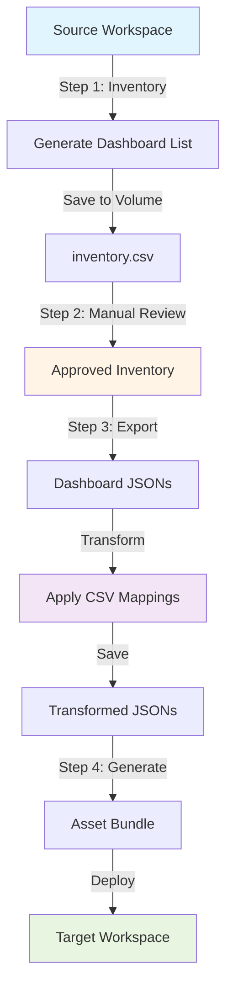
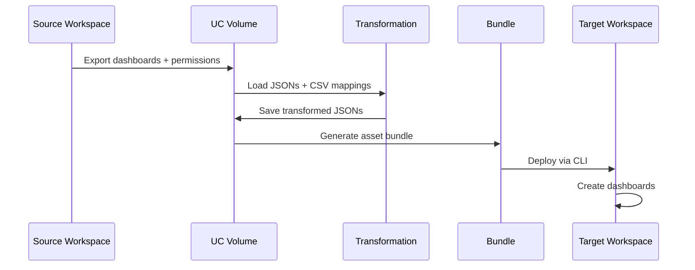

# Databricks Dashboard Migration Toolkit

Complete solution for migrating Databricks Lakeview dashboards across workspaces with catalog/schema transformations.

## 🎯 Features

- ✅ **Automated Discovery**: System table queries for dashboard inventory
- ✅ **Catalog Transformation**: Remap catalog.schema.table references via CSV
- ✅ **Permission Migration**: Capture and apply ACLs
- ✅ **Multi-Environment**: Dev, staging, prod configurations
- ✅ **Serverless & Standard Clusters**: Compatible with both
- ✅ **Asset Bundle Deployment**: Full DAB support for production workflows

## 📋 Prerequisites

- Databricks CLI installed and configured
- Access to source and target workspaces
- Unity Catalog volume for storing artifacts
- SQL warehouse in target workspace

## 🏗️ Architecture

### Migration Flow



### Data Flow



## 🚀 Quick Start

### 1. Configure Your Environment

Edit `databricks.yml` target configuration:

```yaml
targets:
  dev:
    workspace:
      host: https://your-workspace.cloud.databricks.com
    variables:
      catalog: your_source_catalog
      volume_base: /Volumes/catalog/schema/volume
      source_workspace_url: https://source-workspace.cloud.databricks.com
      target_workspace_url: https://target-workspace.cloud.databricks.com
      warehouse_name: your_warehouse
```

### 2. Create Catalog Mapping CSV

Create `/Volumes/catalog/schema/volume/mappings/catalog_schema_mapping.csv`:

```csv
old_catalog,old_schema,old_table,new_catalog,new_schema,new_table,old_volume,new_volume
dev_catalog,bronze,customers,prod_catalog,gold,customers,,
dev_catalog,bronze,,prod_catalog,gold,,,
```

### 3. Run Migration

```bash
cd "Customer-Work/Catalog Migration"
export DATABRICKS_CONFIG_PROFILE=your-profile

# Step 1: Generate inventory
databricks bundle deploy -t dev
databricks bundle run inventory_generation -t dev

# Step 2: Review inventory (open Bundle_02 in Databricks UI)

# Step 3: Export & transform
databricks bundle run export_transform -t dev

# Step 4: Generate & deploy
databricks bundle run generate_deploy -t dev
```

## 📚 Workflow Steps

### Step 1: Inventory Generation

**Notebook**: `Bundle/Bundle_01_Inventory_Generation.ipynb`

Discovers all dashboards in source workspace and generates inventory CSV.

**What it does:**
- Queries system tables for dashboard metadata
- Enriches with audit data (usage, creators, etc.)
- Exports to `dashboard_inventory/inventory.csv`

**Run:**
```bash
databricks bundle run inventory_generation -t dev
```

### Step 2: Manual Review & Approval

**Notebook**: `Bundle/Bundle_02_Review_and_Approve_Inventory.ipynb`

Interactive review process to approve which dashboards to migrate.

**What it does:**
- Displays inventory with filters
- Allows selection/deselection
- Saves approved list to `dashboard_inventory_approved/inventory.csv`

**Run:**
Open notebook in Databricks UI and follow instructions.

### Step 3: Export & Transform

**Notebook**: `Bundle/Bundle_03_Export_and_Transform.ipynb`

Exports approved dashboards and applies catalog transformations.

**What it does:**
- Exports dashboard JSONs from source
- Captures permissions (ACLs)
- Applies CSV mappings to transform catalog references
- Fixes display names (removes ID prefixes)
- Saves to `exported/` and `transformed/` directories

**Run:**
```bash
databricks bundle run export_transform -t dev
```

### Step 4: Generate & Deploy

**Notebook**: `Bundle/Bundle_04_Generate_and_Deploy.ipynb`

Generates asset bundle and deploys to target workspace.

**What it does:**
- Creates bundle structure from transformed dashboards
- Generates databricks.yml and resource definitions
- Validates bundle
- Deploys to target workspace
- Verifies deployment

**Run:**
```bash
databricks bundle run generate_deploy -t dev
```

## ⚙️ Compute Options

### Serverless (Default - Recommended)

**Configuration**: Already enabled in `databricks.yml`

**Benefits:**
- ✅ Faster startup (no cluster provisioning)
- ✅ Auto-scaling
- ✅ No version management
- ✅ Handles dependencies automatically

**Use for:**
- All migration steps
- Development and testing
- Production deployments

### Standard Clusters (Optional)

**Configuration**: Uncomment in `databricks.yml`

**When to use:**
- Serverless not available in your region
- Need specific Spark configurations
- Performance testing

**Setup:**

1. In `databricks.yml`, uncomment for desired job:
```yaml
job_cluster_key: export_cluster
libraries:
  - pypi:
      package: "databricks-sdk>=0.18.0"

job_clusters:
  - job_cluster_key: export_cluster
    new_cluster:
      spark_version: "15.4.x-scala2.12"
      node_type_id: "i3.xlarge"
      num_workers: 2
```

2. NumPy already pinned in notebooks for compatibility

### Comparison

| Feature | Serverless | Standard Cluster |
|---------|------------|------------------|
| Startup Time | ~30s | ~5-10min |
| Cost | Pay per second | Pay per hour (min 1hr) |
| Scaling | Automatic | Manual configuration |
| Dependencies | Auto-managed | Manual install |
| Best For | Migration tasks | Heavy compute |

## 🗂️ Project Structure

```
Catalog Migration/
├── databricks.yml           # Bundle configuration
├── helpers/                 # Python modules
│   ├── __init__.py
│   ├── auth.py             # Workspace authentication
│   ├── discovery.py        # Dashboard discovery
│   ├── export.py           # Dashboard export
│   ├── transform.py        # Catalog transformation
│   ├── permissions.py      # ACL management
│   ├── volume_utils.py     # UC volume operations
│   ├── bundle_generator.py # Asset bundle generation
│   └── config_loader.py    # Configuration utilities
├── Bundle/                  # Notebooks
│   ├── Bundle_01_Inventory_Generation.ipynb
│   ├── Bundle_02_Review_and_Approve_Inventory.ipynb
│   ├── Bundle_03_Export_and_Transform.ipynb
│   └── Bundle_04_Generate_and_Deploy.ipynb
├── catalog_schema_mapping_template.csv  # Example mapping
└── README.md               # This file
```

## 🔧 Configuration Reference

### databricks.yml Variables

| Variable | Description | Example |
|----------|-------------|---------|
| `catalog` | Source catalog to scan | `dev_catalog` |
| `volume_base` | Base path for artifacts | `/Volumes/cat/schema/vol` |
| `source_workspace_url` | Source workspace | `https://source.databricks.com` |
| `target_workspace_url` | Target workspace | `https://target.databricks.com` |
| `warehouse_name` | SQL warehouse | `migration_warehouse` |
| `transformation_enabled` | Enable catalog mapping | `true` |
| `mapping_csv_path` | Path to mapping CSV | `mappings/catalog_schema_mapping.csv` |

### Catalog Mapping CSV Format

```csv
old_catalog,old_schema,old_table,new_catalog,new_schema,new_table,old_volume,new_volume
source_cat,schema1,table1,target_cat,schema2,table2,,
source_cat,schema1,,target_cat,schema2,,,
source_cat,,,target_cat,,,,
```

**Rules:**
- Empty `old_table` → maps entire schema
- Empty `old_schema` → maps entire catalog
- Volumes are optional (for path transformations)

## 🌍 Multi-Environment Setup

### Development
```bash
databricks bundle run export_transform -t dev
```

### Staging (after configuring)
```bash
databricks bundle run export_transform -t staging
```

### Production (after configuring)
```bash
databricks bundle run export_transform -t prod
```

See `databricks.yml` for environment-specific configurations.

## 🐛 Troubleshooting

### Config file not found error

**Error**: `Failed to load config from ../config/config.yaml`

**Solution**: Already fixed! All notebooks use parameters from `databricks.yml`. Re-deploy:
```bash
databricks bundle deploy -t dev
```

### NumPy version conflicts

**Error**: `NumPy 2.x cannot be run in NumPy 1.x`

**Solution**: Already fixed! Notebooks pin `numpy<2`. Use serverless or standard clusters.

### Multiple profiles error

**Error**: `multiple profiles matched`

**Solution**: Set profile:
```bash
export DATABRICKS_CONFIG_PROFILE=your-profile
```

### Permission errors

**Error**: `403 Invalid access token`

**Solution**: Re-authenticate:
```bash
databricks auth login --host https://your-workspace.cloud.databricks.com
```

## 📊 What Gets Migrated

✅ **Included:**
- Dashboard structure and layout
- Datasets and queries
- Visualizations and filters
- Catalog/schema/table references (transformed)
- Permissions (ACLs)
- Display names (cleaned)

❌ **Not Included:**
- Scheduled refreshes (reconfigure in target)
- Subscriptions (reconfigure in target)
- Dashboard history/versions
- Comments and annotations

## 🔒 Security Considerations

- **Credentials**: Never commit to git. Use Databricks profiles.
- **Permissions**: Test with `permissions_dry_run: "true"` first
- **Catalog Access**: Ensure target catalog exists and is accessible
- **Warehouse Access**: Target warehouse must be accessible to deploying user
- **Volume Access**: Requires READ/WRITE on UC volume

## 📝 Best Practices

1. **Test in dev first** - Always validate in development environment
2. **Review inventory** - Use Step 2 to exclude test dashboards
3. **Verify mappings** - Check CSV has correct catalog names
4. **Small batches** - Migrate 10-20 dashboards at a time initially
5. **Backup source** - Export dashboards before transformation
6. **Validate data** - Check dashboards load correctly in target
7. **Document changes** - Keep track of what was migrated when

## 🎓 Advanced Topics

### Custom Transformations

Edit `helpers/transform.py` to add custom transformation logic:

```python
def custom_transformation(dashboard_json: str) -> str:
    data = json.loads(dashboard_json)
    # Your custom logic here
    return json.dumps(data)
```

### Batch Processing

Modify inventory CSV to process dashboards in batches:

```python
# In Bundle_03, modify to process only certain rows
inventory_df = inventory_df[inventory_df['batch'] == 1]
```

### Permission Mapping

Create custom permission mappings in `helpers/permissions.py`:

```python
def map_permissions(source_acl):
    # Map dev groups to prod groups
    return transformed_acl
```

## 🤝 Contributing

Found a bug? Have a feature request? 

1. Document the issue with logs
2. Test the fix in dev environment
3. Update this README if adding features

## 📄 License

Internal tool - see your organization's policies.

## 🆘 Support

- Check troubleshooting section above
- Review error logs in Databricks job runs
- Consult documentation in `Bundle/` directory

---

**Version**: 2.0.0  
**Last Updated**: January 31, 2026  
**Status**: Production Ready ✅
