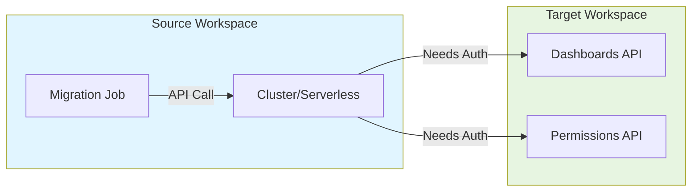
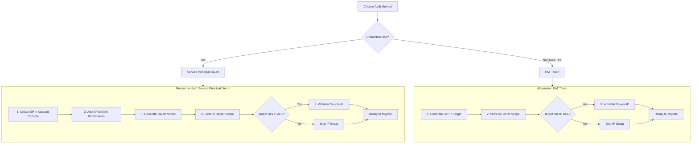
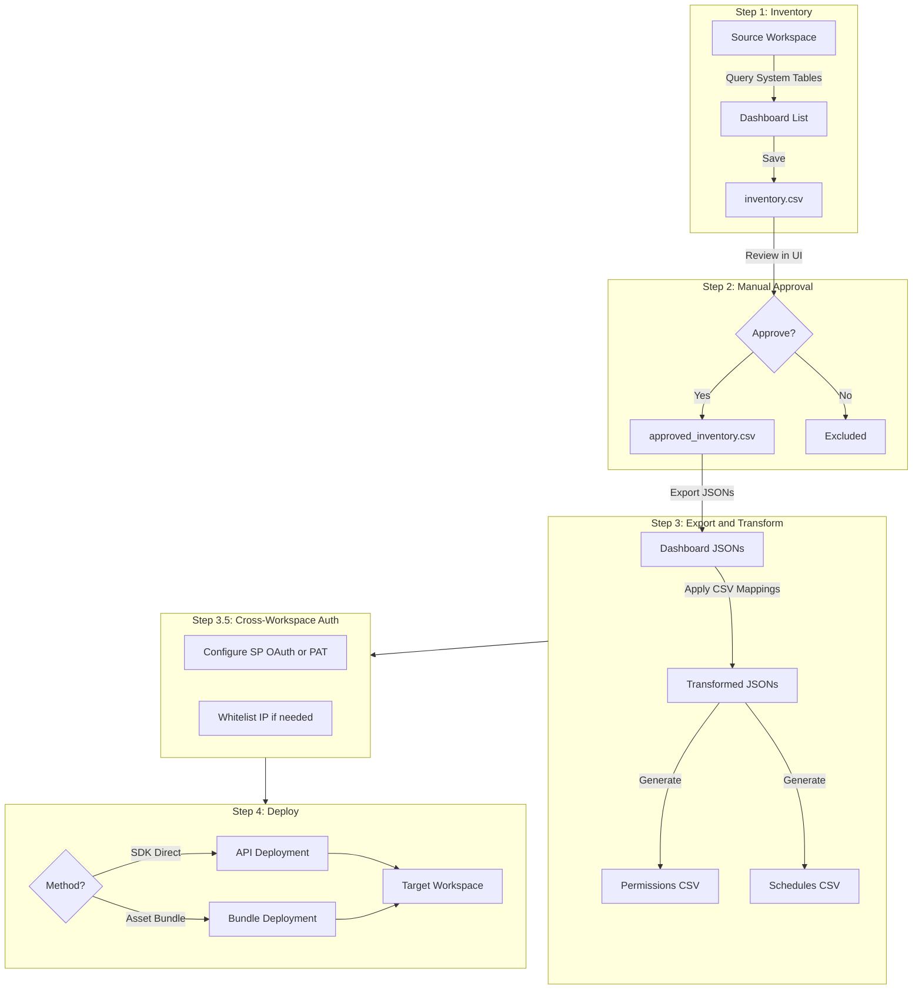

# Databricks Dashboard Migration Toolkit

**Created by Archana Krishnamurthy, Sr Delivery Solutions Architect, Databricks**

Complete solution for migrating Databricks Lakeview dashboards across workspaces with catalog/schema transformations.

## Features

- **Automated Discovery**: System table queries for dashboard inventory
- **Manual Approval**: Review and approve dashboards before migration
- **Catalog Transformation**: Remap catalog.schema.table references via CSV
- **Permission Migration**: Capture and apply ACLs
- **Schedule Migration**: Capture and apply schedules/subscriptions
- **Dual Deployment**: SDK Direct or Asset Bundle methods
- **Cross-Workspace Auth**: Service Principal OAuth (recommended) or PAT Token
- **Runtime Overrides**: CLI parameters for dry_run, target_path, deployment_method
- **Multi-Environment**: Dev, staging, prod configurations
- **Automatic Cleanup**: Archives old files before generating new ones, preserving audit trail

## Prerequisites

- Databricks CLI v0.218.0+ installed locally
- CLI profiles configured in `~/.databrickscfg`
- Workspace Admin access on source and target workspaces
- Unity Catalog volume for storing artifacts
- SQL warehouse in target workspace
- Cross-workspace authentication configured:
  - **Recommended**: Service Principal with OAuth M2M
  - **Alternative**: PAT Token (for quick dev/test)

## Getting Started - Two Options

### Option 1: CLI Execution (Recommended for Automation)

Clone the repository and run from your local machine:

```bash
# Clone the repository
git clone https://github.com/your-org/dashboard-migration.git

# Navigate to the migration folder
cd dashboard-migration/Customer-Folder/Catalog\ Migration

# Configure databricks.yml with your workspace details
# Then deploy and run (see Quick Start section below)
```

**Folder placement:** Place the cloned folder anywhere on your machine. All paths are relative to `databricks.yml`.

### Option 2: Interactive Notebook Execution

For interactive execution in the Databricks UI:

1. Clone the repo to your Databricks Workspace (Repos → Add Repo)
2. Open each notebook in sequence (Bundle_01 → 02 → 03 → 04)
3. Configure widgets/parameters in each notebook
4. Run cells interactively

**Best for:** First-time users, debugging, understanding the workflow.

> **Important for IP Whitelisting:** If your target workspace has IP Access Lists enabled, you'll need to whitelist your source cluster IP before Step 4. The IP detection can be done interactively (see [ip-detection/README.md](ip-detection/README.md#interactive-usage-databricks-ui)), but the actual whitelisting requires the Databricks CLI from your local terminal.

## Quick CLI Setup

### Step 1: Install Databricks CLI

```bash
pip install databricks-cli --upgrade
databricks --version  # Must be >= 0.218.0
```

### Step 2: Configure CLI Profiles

You need **two CLI profiles** - one for each workspace:

```bash
# Configure SOURCE workspace profile (where dashboards currently exist)
databricks configure --profile source-workspace
# When prompted:
#   Host: https://YOUR-SOURCE-WORKSPACE.cloud.databricks.com
#   Token: <your PAT from source workspace>

# Configure TARGET workspace profile (where dashboards will be migrated)
databricks configure --profile target-workspace
# When prompted:
#   Host: https://YOUR-TARGET-WORKSPACE.cloud.databricks.com
#   Token: <your PAT from target workspace>
```

### Step 3: Test Both Profiles

```bash
# Verify source profile works
databricks workspace list / --profile source-workspace

# Verify target profile works  
databricks workspace list / --profile target-workspace
```

> **Tip:** Generate PAT tokens from each workspace: User Settings → Developer → Access Tokens → Generate New Token

## Cross-Workspace Authentication

When deploying dashboards from source to target workspace, the source cluster needs to authenticate with the target workspace API.

### Why Cross-Workspace Auth is Required



The source workspace cluster must authenticate to the target workspace to:
- Create dashboards via API
- Apply permissions
- Create schedules and subscriptions

### Authentication Options Comparison

| Feature | Service Principal OAuth | PAT Token |
|---------|------------------------|-----------|
| **Recommendation** | **Recommended** | Fallback |
| Setup Complexity | Medium | Simple |
| Security | High (auto-rotating) | Lower (manual rotation) |
| Audit Trail | SP identity (clean) | User identity |
| Credential Lifetime | Configurable | Fixed expiry |
| Production Ready | Yes | Dev/Test only |
| IP Whitelisting | Required if ACL enabled | Required if ACL enabled |

### Authentication Flow



### Option 1: Service Principal OAuth M2M (Recommended)

**Best for:** Production, automation, compliance, secure credential management.

**Benefits:**
- Dedicated service identity (not tied to a user)
- Clean audit trail showing SP actions
- Credentials can be auto-rotated
- Follows Databricks security best practices

> **Important:** If the target workspace has **IP Access Lists** enabled, you must still whitelist the source cluster IP regardless of authentication method. IP ACLs are network-level restrictions that apply before authentication. SP OAuth provides credential security, not IP bypass.

```bash
# Step 1: Create Service Principal in Account Console
# Account Console → User Management → Service Principals → Add

# Step 2: Add SP to BOTH workspaces
# Account Console → Workspaces → [workspace] → Permissions → Add SP
# Repeat for source AND target workspace

# Step 3: Generate OAuth Secret
# Account Console → Service Principals → [your SP] → Secrets → Generate
# IMPORTANT: Save the Client ID and Client Secret immediately

# Step 4: Create secret scope and store credentials
databricks secrets create-scope migration_secrets --profile source-workspace

databricks secrets put-secret migration_secrets sp_client_id --profile source-workspace
# (Enter Client ID when prompted)

databricks secrets put-secret migration_secrets sp_client_secret --profile source-workspace
# (Enter Client Secret when prompted)

# Step 5: Configure in databricks.yml
# Set these variables:
#   auth_method: "sp_oauth"
#   sp_secret_scope: "migration_secrets"
```

**If target workspace has IP Access Lists enabled:**
```bash
# Find source cluster's egress IP (run in notebook on source workspace)
import requests
print(requests.get('https://api.ipify.org').text)

# Add to target workspace IP allowlist
databricks ip-access-lists create \
  --label "source-workspace-migration" \
  --list-type ALLOW \
  --ip-addresses "YOUR.IP.HERE/32" \
  --profile target-workspace
```

See [setup-guides/SP_OAUTH_SETUP.md](setup-guides/SP_OAUTH_SETUP.md) for detailed Service Principal setup guide.

### Option 2: PAT Token (Alternative - Quick Setup)

**Best for:** Development, quick testing, when SP setup is not feasible.

**Note:** Use this only when Service Principal setup is not possible. PAT tokens are tied to a user account and require manual rotation.

```bash
# Step 1: Generate PAT in TARGET workspace
# User Settings → Developer → Access Tokens → Generate
# Set appropriate expiry (recommend 90 days max)

# Step 2: Create secret scope in SOURCE workspace
databricks secrets create-scope migration_secrets --profile source-workspace

# Step 3: Store the PAT token
databricks secrets put-secret migration_secrets target_workspace_token --profile source-workspace
# (Enter the PAT when prompted)

# Step 4: Configure in databricks.yml
# Set these variables:
#   auth_method: "pat"
#   target_workspace_secret_scope: "migration_secrets"
```

**If target workspace has IP Access Lists enabled:** Same IP whitelisting steps as SP OAuth above.

## Migration Flow



## Quick Start

### 1. Configure Environment

```bash
cd "Customer-Folder/Catalog Migration"
```

Edit `databricks.yml` target variables:

```yaml
targets:
  dev:
    workspace:
      host: https://your-source-workspace.cloud.databricks.com
    variables:
      catalog: your_source_catalog
      volume_base: /Volumes/catalog/schema/migration_volume
      source_workspace_url: https://source-workspace.cloud.databricks.com
      target_workspace_url: https://target-workspace.cloud.databricks.com
      warehouse_id: "your_warehouse_id"  # 16-char hex ID
      
      # Authentication (choose one)
      auth_method: "sp_oauth"              # Recommended
      sp_secret_scope: "migration_secrets"
      
      # OR for quick dev/test:
      # auth_method: "pat"
      # target_workspace_secret_scope: "migration_secrets"
```

### 2. Create Catalog Mapping CSV

Upload to `/Volumes/catalog/schema/volume/mappings/catalog_schema_mapping.csv`:

```csv
old_catalog,old_schema,old_table,new_catalog,new_schema,new_table,old_volume,new_volume
dev_catalog,bronze,customers,prod_catalog,gold,customers,,
dev_catalog,bronze,,prod_catalog,gold,,,
```

### 3. Run Migration

```bash
# Deploy bundle (one-time setup)
databricks bundle deploy -t dev --profile source-workspace

# Step 1: Generate inventory
databricks bundle run inventory_generation -t dev --profile source-workspace

# Step 2: Manual approval (open Bundle_02 in Databricks UI)
# Review and approve dashboards interactively

# Step 3: Export & transform
databricks bundle run export_transform -t dev --profile source-workspace

# Step 3.5: Configure cross-workspace auth (see section above)
# - Set up SP OAuth (recommended) or PAT token
# - Whitelist IP if target has IP ACLs:
./scripts/auto_setup_ip_acl.sh \
  --source-profile source-workspace \
  --target-profile target-workspace \
  --volume-base /Volumes/YOUR_CATALOG/YOUR_SCHEMA/dashboard_migration

# Step 4a: Generate bundle OR deploy via SDK
# For Asset Bundle (generates bundle, then deploy via CLI):
databricks bundle run generate_deploy -t dev --profile source-workspace \
  --params "deployment_method=asset_bundle"

# For SDK Direct (deploys immediately - dry run first):
databricks bundle run generate_deploy -t dev --profile source-workspace \
  --params "deployment_method=sdk_direct,dry_run_mode=true"

# Step 4b: If using Asset Bundle, deploy from local terminal
./scripts/deploy_asset_bundle.sh \
  --source-profile source-workspace \
  --target-profile target-workspace \
  --volume-base /Volumes/YOUR_CATALOG/YOUR_SCHEMA/dashboard_migration \
  --dry-run  # Remove this flag for actual deployment

# If using SDK Direct and dry run looked good, deploy for real:
databricks bundle run generate_deploy -t dev --profile source-workspace \
  --params "deployment_method=sdk_direct,dry_run_mode=false"

# Step 5: Validate and cleanup IP whitelist
./scripts/cleanup_ip_acl.sh --target-profile target-workspace
```

## Complete Command Reference

All commands for a full end-to-end migration, organized by step. Copy-paste ready.

### Prerequisites

```bash
# Ensure CLI is installed and profiles configured
databricks --version  # Must be >= 0.218.0

# Navigate to project folder
cd "Customer-Folder/Catalog Migration"
```

### Step 0: Deploy Bundle (One-Time Setup)

```bash
databricks bundle deploy -t dev --profile source-workspace
```

### Step 1: Generate Inventory

```bash
databricks bundle run inventory_generation -t dev --profile source-workspace
```

### Step 2: Manual Review and Approval (UI Required)

```
# This step MUST be done in Databricks UI - no CLI command
1. Open source workspace in browser
2. Navigate to: Repos → [your-repo] → Bundle/Bundle_02_Review_and_Approve_Inventory.ipynb
3. Run all cells to review inventory
4. Select/deselect dashboards to migrate
5. Run approval cell to save approved_inventory.csv
```

### Step 3: Export and Transform

```bash
databricks bundle run export_transform -t dev --profile source-workspace
```

### Step 3.5: Cross-Workspace Authentication

Choose **one** authentication method:

#### Option A: Service Principal OAuth (Recommended for Production)

```bash
# 1. Create secret scope
databricks secrets create-scope migration_secrets --profile source-workspace

# 2. Store SP credentials (Client ID and Secret from Account Console)
databricks secrets put-secret migration_secrets sp_client_id --profile source-workspace
databricks secrets put-secret migration_secrets sp_client_secret --profile source-workspace

# 3. Update databricks.yml:
#    auth_method: "sp_oauth"
#    sp_secret_scope: "migration_secrets"
```

#### Option B: PAT Token (Quick Setup for Dev/Test)

```bash
# 1. Generate PAT in TARGET workspace UI: User Settings → Developer → Access Tokens

# 2. Create secret scope in SOURCE workspace
databricks secrets create-scope migration_secrets --profile source-workspace

# 3. Store the PAT
databricks secrets put-secret migration_secrets target_workspace_token --profile source-workspace

# 4. Update databricks.yml:
#    auth_method: "pat"
#    target_workspace_secret_scope: "migration_secrets"
```

### Step 3.5b: IP Whitelisting (If Target Has IP ACLs)

> **Shell scripts only** - Run from local terminal, not Databricks UI

```bash
# Auto-detect cluster IP and whitelist on target (recommended)
./scripts/auto_setup_ip_acl.sh \
  --source-profile source-workspace \
  --target-profile target-workspace \
  --volume-base /Volumes/YOUR_CATALOG/YOUR_SCHEMA/dashboard_migration

# Or dry run first to preview
./scripts/auto_setup_ip_acl.sh \
  --source-profile source-workspace \
  --target-profile target-workspace \
  --volume-base /Volumes/YOUR_CATALOG/YOUR_SCHEMA/dashboard_migration \
  --dry-run

# Or provide IP directly (skip auto-detection)
./scripts/auto_setup_ip_acl.sh \
  --cluster-ip YOUR.IP.HERE \
  --target-profile target-workspace
```

### Step 4: Deploy Dashboards

**Choose your deployment method:**

#### Method A: SDK Direct (Notebook deploys everything)

```bash
# Dry run first (preview - no resources created)
databricks bundle run generate_deploy -t dev --profile source-workspace \
  --params "deployment_method=sdk_direct,dry_run_mode=true"

# If dry run looks good, deploy for real
databricks bundle run generate_deploy -t dev --profile source-workspace \
  --params "deployment_method=sdk_direct,dry_run_mode=false"
```

#### Method B: Asset Bundle (Notebook generates, CLI deploys)

```bash
# Step 4a: Run notebook to generate bundle (same command for dry/live)
databricks bundle run generate_deploy -t dev --profile source-workspace \
  --params "deployment_method=asset_bundle"

# Step 4b: Deploy from LOCAL terminal with dry run first
./scripts/deploy_asset_bundle.sh \
  --source-profile source-workspace \
  --target-profile target-workspace \
  --volume-base /Volumes/YOUR_CATALOG/YOUR_SCHEMA/dashboard_migration \
  --dry-run

# Step 4c: If dry run looks good, deploy for real (remove --dry-run)
./scripts/deploy_asset_bundle.sh \
  --source-profile source-workspace \
  --target-profile target-workspace \
  --volume-base /Volumes/YOUR_CATALOG/YOUR_SCHEMA/dashboard_migration
```

**OR manually without the script:**

```bash
# Download bundle from volume
databricks fs cp -r \
  dbfs:/Volumes/YOUR_CATALOG/YOUR_SCHEMA/dashboard_migration/bundles/dashboard_migration \
  ./dashboard_bundle \
  --profile source-workspace \
  --overwrite

# Navigate to bundle
cd ./dashboard_bundle

# Dry run deploy
databricks bundle deploy --dry-run --profile target-workspace

# Deploy for real
databricks bundle deploy --profile target-workspace
```

### Step 5: Validate and Cleanup

```bash
# 1. Validate in target workspace UI:
#    - Open target workspace
#    - Navigate to SQL → Dashboards
#    - Verify dashboards are present and working
#    - Check permissions and schedules

# 2. Cleanup IP whitelist (if you added one in Step 3.5b)
# Shell script only - run from local terminal
./scripts/cleanup_ip_acl.sh --target-profile target-workspace
```

## Workflow Steps Detail

### Step 1: Inventory Generation

**Notebook**: `Bundle/Bundle_01_Inventory_Generation.ipynb`

Discovers all dashboards from source workspace and generates inventory CSV.

**Command:**
```bash
databricks bundle run inventory_generation -t dev --profile source-workspace
```

**Output:** `inventory.csv` saved to volume

---

### Step 2: Manual Review and Approval

**Notebook**: `Bundle/Bundle_02_Review_and_Approve_Inventory.ipynb`

**This step requires manual intervention in the Databricks UI:**
1. Open the notebook in your source workspace
2. Review the inventory table
3. Select/deselect dashboards to migrate
4. Run the approval cell to save `inventory_approved.csv`

**Output:** `inventory_approved.csv` saved to volume

---

### Step 3: Export and Transform

**Notebook**: `Bundle/Bundle_03_Export_and_Transform.ipynb`

Exports approved dashboards and applies catalog/schema transformations.

**Command:**
```bash
databricks bundle run export_transform -t dev --profile source-workspace
```

**What this does:**
- Reads `inventory_approved.csv`
- Exports dashboard JSONs from source
- Applies catalog mapping transformations
- Captures permissions and schedules
- Archives old files before writing new ones
- Saves transformed dashboards to volume

**Output:** 
- Transformed dashboard JSONs (`*.lvdash.json`)
- Permissions CSV
- Schedules CSV

---

### Step 3.5: Configure Cross-Workspace Authentication

**CRITICAL: Before Step 4, ensure authentication is configured!**

Choose one:
- **Recommended**: Service Principal OAuth M2M (see [Option 1](#option-1-service-principal-oauth-m2m-recommended))
- **Alternative**: PAT Token (see [Option 2](#option-2-pat-token-alternative---quick-setup))

**If target workspace has IP Access Lists enabled**, whitelist the source cluster IP:

> **Note:** The IP ACL scripts are **bash shell scripts** that must be run from your **local terminal** (macOS, Linux, or Windows Git Bash/WSL). They cannot run inside Databricks notebooks or the Databricks UI. The scripts require the Databricks CLI to be installed and configured with profiles.

```bash
# Option A: Full automated setup (recommended)
./scripts/auto_setup_ip_acl.sh \
  --source-profile source-workspace \
  --target-profile target-workspace \
  --volume-base /Volumes/YOUR_CATALOG/YOUR_SCHEMA/dashboard_migration

# Option B: Dry run first to preview actions
./scripts/auto_setup_ip_acl.sh \
  --source-profile source-workspace \
  --target-profile target-workspace \
  --volume-base /Volumes/YOUR_CATALOG/YOUR_SCHEMA/dashboard_migration \
  --dry-run

# Option C: Provide IP directly (skip auto-detection)
./scripts/auto_setup_ip_acl.sh \
  --cluster-ip YOUR.IP.HERE \
  --target-profile target-workspace
```

For interactive IP detection (to get the IP manually), see [Bundle/Bundle_IP_ACL_Setup.ipynb](Bundle/Bundle_IP_ACL_Setup.ipynb).

### Step 4: Generate and Deploy

**Notebook**: `Bundle/Bundle_04_Generate_and_Deploy.ipynb`

Two deployment methods are available. Both run the same notebook first, but differ in how/where deployment happens.

#### Option A: Asset Bundle (Recommended for GitOps/CI-CD)

**Phase 1: Generate Bundle (Notebook)**

The notebook generates a Databricks Asset Bundle and saves it to UC Volume:

```bash
# Run notebook to generate bundle
# NOTE: dry_run_mode doesn't affect bundle generation - it always generates the bundle
databricks bundle run generate_deploy -t dev --profile source-workspace \
  --params "deployment_method=asset_bundle"
```

**What this does:**
- Loads transformed dashboards from volume
- Generates Asset Bundle structure
- Saves to: `/Volumes/YOUR_CATALOG/YOUR_SCHEMA/dashboard_migration/bundles/dashboard_migration`
- **Stops here** - shows CLI instructions for deployment

---

**Phase 2: Deploy Bundle (CLI from LOCAL terminal)**

After the notebook completes, deploy the bundle using CLI commands:

**Method 1: Using the deploy script (recommended)**

```bash
# Dry run first (preview changes)
./scripts/deploy_asset_bundle.sh \
  --source-profile source-workspace \
  --target-profile target-workspace \
  --volume-base /Volumes/YOUR_CATALOG/YOUR_SCHEMA/dashboard_migration \
  --dry-run

# If dry run looks good, deploy for real (remove --dry-run flag)
./scripts/deploy_asset_bundle.sh \
  --source-profile source-workspace \
  --target-profile target-workspace \
  --volume-base /Volumes/YOUR_CATALOG/YOUR_SCHEMA/dashboard_migration
```

**Method 2: Manual CLI commands**

```bash
# 1. Download bundle from volume to local machine
databricks fs cp -r \
  dbfs:/Volumes/YOUR_CATALOG/YOUR_SCHEMA/dashboard_migration/bundles/dashboard_migration \
  ./dashboard_bundle \
  --profile source-workspace \
  --overwrite

# 2. Navigate to bundle folder
cd ./dashboard_bundle

# 3. Dry run deploy (preview changes)
databricks bundle deploy --dry-run --profile target-workspace

# 4. If dry run looks good, deploy for real
databricks bundle deploy --profile target-workspace
```

---

#### Option B: SDK Direct (Recommended for Notebook-Only Workflow)

The notebook deploys directly to target workspace using SDK API calls. No CLI steps needed after notebook runs.

```bash
# Dry run first (preview - no resources created)
databricks bundle run generate_deploy -t dev --profile source-workspace \
  --params "deployment_method=sdk_direct,dry_run_mode=true"

# If dry run looks good, deploy for real
databricks bundle run generate_deploy -t dev --profile source-workspace \
  --params "deployment_method=sdk_direct,dry_run_mode=false"
```

**What this does:**
- Loads transformed dashboards
- Connects to target workspace via SDK
- Creates/publishes dashboards directly
- Applies permissions
- **Handles existing dashboards**: If a dashboard with the same name exists elsewhere (e.g., archived), it automatically renames the old one and creates the new one in the target folder
- **No CLI steps needed** - fully automated in notebook

---

**Comparison:**

| Method | Notebook Run | Dry Run Control | Deployment Location | Best For |
|--------|-------------|-----------------|---------------------|----------|
| **Asset Bundle** | Same for both | CLI flag (`--dry-run`) | CLI on local machine | GitOps, CI/CD, version control |
| **SDK Direct** | Varies by `dry_run_mode` param | Notebook param (`dry_run_mode`) | Within notebook | Quick deployment, notebook-only |

**Key Differences:**
- **Asset Bundle**: Notebook run is SAME for dry/live run. Dry run happens at CLI level with `--dry-run` flag.
- **SDK Direct**: Notebook run VARIES by `dry_run_mode` parameter. No CLI steps needed after notebook.

**Visual Flow:**

```
SDK Direct:
  Notebook (dry_run_mode=true)  → Preview complete → Done
  Notebook (dry_run_mode=false) → Dashboards deployed → Done

Asset Bundle:
  Notebook (deployment_method=asset_bundle) → Bundle generated → 
    CLI (--dry-run) → Preview → 
    CLI (no --dry-run) → Dashboards deployed → Done
```

---

### Step 5: Validate and Cleanup

After successful migration, validate dashboards in the target workspace, then clean up IP whitelisting.

> **Note:** The cleanup script is a **bash shell script** - run from your **local terminal**, not Databricks UI.

```bash
# After validating migration, remove IP from target allowlist
./scripts/cleanup_ip_acl.sh --target-profile target-workspace

# Or with specific IP
./scripts/cleanup_ip_acl.sh --cluster-ip 35.155.15.56 --target-profile target-workspace

# Skip confirmation prompts (automation)
./scripts/cleanup_ip_acl.sh --force
```

## Where to Find Deployed Resources

After running the migration, resources are located in different places:

### 1. Deployed Dashboards (Target Workspace)

**Location:** SQL Dashboards section of target workspace

**To view:**
1. Navigate to target workspace in browser
2. Click **SQL** in left sidebar
3. Click **Dashboards**
4. Look in folder: `/Shared/Migrated_Dashboards_V2/` (or your configured `target_parent_path`)

**Note:** Dashboards are NOT in Workspace folders - they're in the SQL Dashboards section!

### 2. Migration Notebooks & Code (Source Workspace)

**Location:** `.bundle` folder in source workspace

**To view:**
```
Workspace → Users → your-email@company.com → .bundle → dashboard_migration → dev → files
```

Contains:
- `Bundle/` - All 4 notebooks
- `helpers/` - Python helper modules

### 3. Volume Files (Both Workspaces)

**Location:** Unity Catalog Volume (accessible from both workspaces)

**To view:**
1. Click **Catalog** in left sidebar
2. Navigate to: `your_catalog` → `your_schema` → `dashboard_migration` (volume)

**Folders:**
- `dashboard_inventory/` - Generated inventory with `archive/` subfolder
- `dashboard_inventory_approved/` - Approved inventory with `archive/` subfolder  
- `dashboard_exported/` - Exported dashboard JSONs with `archive/` subfolder
- `dashboard_transformed/` - Transformed dashboards with `archive/` subfolder
- `bundles/` - Asset Bundle files (if using Asset Bundle deployment)
- Each folder has timestamped archives preserving previous runs

## Runtime Parameter Overrides

Step 4 supports runtime parameter overrides via `--params`:

| Parameter | Default | Description |
|-----------|---------|-------------|
| `dry_run_mode` | `true` | Preview only (no resources created) |
| `deployment_method` | `sdk_direct` | `sdk_direct` or `asset_bundle` |
| `target_parent_path` | `/Shared/Migrated_Dashboards_V2` | Target folder path |

### CLI Examples

```bash
# Dry run (default - safe preview)
databricks bundle run generate_deploy -t dev --profile source-workspace

# Live deployment
databricks bundle run generate_deploy -t dev \
  --params "dry_run_mode=false" \
  --profile source-workspace

# SDK deployment to custom path
databricks bundle run generate_deploy -t dev \
  --params "dry_run_mode=false,target_parent_path=/Shared/Production/Dashboards" \
  --profile source-workspace

# Asset Bundle deployment
databricks bundle run generate_deploy -t dev \
  --params "dry_run_mode=false,deployment_method=asset_bundle" \
  --profile source-workspace
```

## Deployment Methods

| Feature | SDK Direct (Default) | Asset Bundle |
|---------|---------------------|--------------|
| Dashboards | API calls | Bundle deploy |
| Permissions | Immediate | Bundle deploy |
| Schedules | Immediate | SDK post-deploy |
| Complexity | Simple | Medium |
| Best For | General migrations | IaC workflows |

## Project Structure

```
Catalog Migration/
├── databricks.yml                    # Bundle configuration
├── README.md                         # This file
├── catalog_schema_mapping_template.csv
├── Bundle/
│   ├── Bundle_01_Inventory_Generation.ipynb
│   ├── Bundle_02_Review_and_Approve_Inventory.ipynb
│   ├── Bundle_03_Export_and_Transform.ipynb
│   ├── Bundle_04_Generate_and_Deploy.ipynb
│   └── Bundle_IP_ACL_Setup.ipynb     # IP whitelisting guide
├── scripts/
│   ├── auto_setup_ip_acl.sh          # Auto-detect and whitelist IP
│   └── cleanup_ip_acl.sh             # Remove IP after migration
├── ip-detection/
│   ├── databricks.yml                # Mini-bundle for IP detection job
│   ├── README.md
│   └── notebooks/
│       └── Detect_Cluster_IP.ipynb   # IP detection notebook
├── helpers/
│   ├── __init__.py
│   ├── auth.py                       # Workspace authentication
│   ├── bundle_generator.py           # Asset bundle generation
│   ├── config_loader.py              # Configuration utilities
│   ├── config_validator.py           # Pre-flight validation
│   ├── dbutils_helper.py             # dbutils wrapper
│   ├── deployment_package.py         # Deployment data structures
│   ├── discovery.py                  # Dashboard discovery
│   ├── export.py                     # Dashboard export
│   ├── ip_acl_manager.py             # IP whitelist management
│   ├── permissions.py                # ACL management
│   ├── schedules.py                  # Schedule management
│   ├── sdk_deployer.py               # SDK deployment
│   ├── sp_oauth_auth.py              # Service Principal auth
│   ├── transform.py                  # Catalog transformation
│   └── volume_utils.py               # UC volume operations
└── setup-guides/                     # Setup and configuration guides
    ├── Setup_Migration_Secrets.ipynb # Interactive PAT setup helper
    └── SP_OAUTH_SETUP.md             # Service Principal OAuth guide
```

## Configuration Reference

### Key Variables in databricks.yml

| Variable | Description |
|----------|-------------|
| `catalog` | Source catalog to scan |
| `volume_base` | Base path for artifacts (e.g., `/Volumes/cat/schema/vol`) |
| `source_workspace_url` | Source workspace URL |
| `target_workspace_url` | Target workspace URL |
| `warehouse_id` | Target warehouse ID (16-char hex) |
| `auth_method` | `sp_oauth` (recommended) or `pat` |
| `sp_secret_scope` | Secret scope for SP OAuth credentials |
| `target_workspace_secret_scope` | Secret scope for PAT token |
| `transformation_enabled` | Enable catalog mapping (`true`/`false`) |
| `mapping_csv_path` | Path to mapping CSV |
| `apply_permissions` | Apply ACLs to target (`true`/`false`) |
| `apply_schedules` | Apply schedules to target (`true`/`false`) |
| `deployment_method` | `sdk_direct` or `asset_bundle` |
| `dry_run_mode` | Preview without deploying (`true`/`false`) |

## Troubleshooting

### Cross-Workspace Authentication Errors

**Error**: `403 Invalid access token` or `401 Unauthorized`

**Solution**:
1. Verify credentials are stored correctly:
   ```bash
   databricks secrets list-secrets migration_secrets --profile source-workspace
   ```
2. For PAT: Verify token hasn't expired
3. For SP OAuth: Verify SP is added to target workspace with correct permissions

### IP Whitelist Errors

**Error**: `403 IP not allowed` or connection timeout

**Solution**:
1. Get source cluster IP:
   ```python
   import requests
   print(requests.get('https://api.ipify.org').text)
   ```
2. Add to target workspace IP allowlist

### Bundle Deploy Errors

```bash
# Validate bundle
databricks bundle validate -t dev --profile source-workspace

# Force redeploy
databricks bundle deploy -t dev --profile source-workspace
```

## What Gets Migrated

**Included:**
- Dashboard structure and layout
- Datasets and queries
- Visualizations and filters
- Catalog/schema/table references (transformed)
- Permissions (ACLs)
- Scheduled refreshes
- Subscriptions

**Not Included:**
- Dashboard history/versions
- Comments and annotations

---

## Resources

- [Why This Toolkit vs Terraform](WHY_THIS_TOOLKIT.md) - Comparison with Terraform and scenarios covered

---

**Version**: 2.7.0  
**Last Updated**: February 3, 2026  
**Status**: Production Ready
