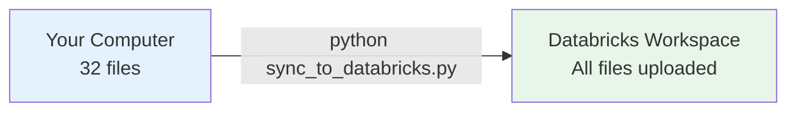
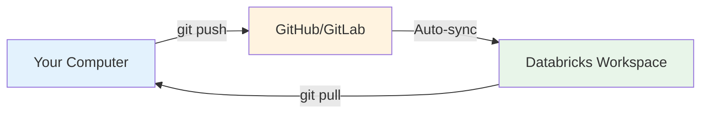

# Sync Options: Quick Comparison

## Two Ways to Get Your Files to Databricks

### Option 1: Sync Script (Quick & Simple)

**Perfect for:** Testing, quick iterations, getting started



**Steps:**
1. Configure CLI once: `databricks configure --token`
2. Run: `python sync_to_databricks.py`
3. Done! Files in Databricks

**Time:** 2 minutes setup, 30 seconds per sync

**Pros:**
- ✅ Very simple
- ✅ No Git needed
- ✅ One command

**Cons:**
- ❌ Manual re-run for updates
- ❌ No version history
- ❌ No team collaboration

---

### Option 2: Databricks Repos (Automatic Syncing)

**Perfect for:** Production, teams, version control



**Steps:**
1. Initialize Git: `git init`
2. Push to GitHub: `git push`
3. Connect Databricks to GitHub
4. Add Repo in Databricks

**Time:** 10 minutes setup, automatic forever

**Pros:**
- ✅ Automatic syncing
- ✅ Version control (track changes)
- ✅ Team collaboration
- ✅ Industry standard
- ✅ Two-way sync

**Cons:**
- ❌ Requires Git/GitHub setup
- ❌ More steps initially

---

## Side-by-Side Comparison

| Feature | Sync Script | Databricks Repos |
|---------|-------------|------------------|
| **Setup time** | 2 minutes | 10 minutes |
| **Commands needed** | 2 | 5-6 |
| **Git required?** | No | Yes |
| **GitHub account?** | No | Yes |
| **Re-sync process** | Run script again | `git push` (automatic) |
| **Version history** | None | Full Git history |
| **Rollback changes** | Manual | `git revert` |
| **Team collaboration** | Email files | Git clone |
| **Two-way sync** | No | Yes |
| **Cost** | Free | Free |
| **Best for** | Quick testing | Production use |

---

## Workflow Comparison

### With Sync Script:

```
1. Edit files locally
2. Run: python sync_to_databricks.py
3. Open Databricks
4. Files updated
5. Test changes
6. (Repeat for each update)
```

### With Databricks Repos:

```
1. Edit files locally
2. git add . && git commit -m "changes"
3. git push
4. Databricks auto-updates
5. Test changes
6. (Much faster iterations)
```

---

## My Recommendation

### For Your Current Situation:

**Start with Sync Script** ✅
- You're testing Bundle approach
- Quick iterations likely
- Want to get started fast
- Can always upgrade to Repos later

**Use:** `python sync_to_databricks.py`

### Later (After Testing Success):

**Switch to Databricks Repos** ✅
- Production deployments
- Multiple environments (dev/prod)
- Team collaboration
- Version control benefits

**See:** `DATABRICKS_REPOS_SETUP.md`

---

## What You Asked: "Why Can't I Sync Like Before?"

**Answer:** You CAN! Here's how:

### Before (Old Structure):
```bash
python sync_to_databricks.py
# ✅ Uploaded 7 files
```

### Now (New Modular Structure):
```bash
python sync_to_databricks.py
# ✅ Uploads 32 files (config, helpers, Bundle, notebooks, docs)
```

**Same command, updated file list!**

---

## Quick Decision Guide

**Choose Sync Script if:**
- "I want to test Bundle approach TODAY"
- "I don't want to learn Git right now"
- "I just need quick uploads"
- "I'm the only person using this"

**Choose Databricks Repos if:**
- "I want this for long-term use"
- "I want to track changes over time"
- "Others on my team will use this"
- "I want professional version control"

**You can start with Sync Script and upgrade to Repos anytime!**

---

## Next Steps

### Right Now (Testing):
1. ✅ Run `python sync_to_databricks.py`
2. ✅ Follow `TESTING_GUIDE.md`
3. ✅ Test Bundle approach

### Later (Production):
1. Follow `DATABRICKS_REPOS_SETUP.md`
2. Switch to Git-based workflow
3. Enjoy automatic syncing

**Both options work perfectly!** Start with what's easiest. 🚀
