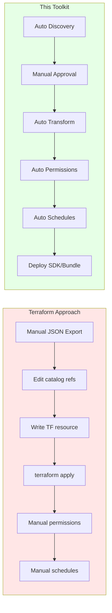

# Why This Toolkit vs Terraform

## Terraform Limitations for Lakeview Dashboards

Terraform's Databricks provider is excellent for infrastructure-as-code but has significant limitations for **Lakeview Dashboard migrations**:

| Aspect | Terraform | This Toolkit |
|--------|-----------|--------------|
| **Dashboard Type** | Legacy DBSQL dashboards only (`databricks_dashboard`) | **Lakeview dashboards** (AI/BI) |
| **Cross-Workspace** | Complex state management; no built-in migration | **Native cross-workspace support** |
| **Catalog Remapping** | Manual JSON editing required | **CSV-driven transformation** |
| **Permissions** | Separate resource; manual sync | **Automatic ACL capture and apply** |
| **Schedules** | Not supported for dashboards | **Full schedule/subscription migration** |
| **Inventory** | Manual resource identification | **Automated system table discovery** |
| **Approval Workflow** | None | **Manual review before migration** |
| **Dry Run** | `terraform plan` (infra-focused) | **Dashboard-specific preview** |

## Key Differences

### 1. Lakeview vs Legacy Dashboards

- Terraform's `databricks_dashboard` resource targets legacy SQL dashboards
- Lakeview dashboards (AI/BI) have a completely different JSON structure with embedded datasets, queries, and visualizations
- This toolkit handles Lakeview's complex serialized definition natively

### 2. Cross-Workspace Migration

- Terraform requires separate state files per workspace and manual coordination
- This toolkit handles authentication, IP whitelisting, and API calls across workspaces seamlessly

### 3. Catalog Transformation

- Terraform would require manual JSON editing or complex templating
- This toolkit applies CSV-based mappings automatically: `dev_catalog.bronze.table` → `prod_catalog.gold.table`

### 4. Metadata Preservation

- Terraform doesn't capture dashboard permissions or schedules as linked resources
- This toolkit exports and re-applies ACLs, schedules, and subscriptions

## Scenarios This Toolkit Covers

| Scenario | Description | Terraform Viable? |
|----------|-------------|-------------------|
| **Workspace Consolidation** | Merge dashboards from multiple workspaces into one | No - cross-workspace state issues |
| **Environment Promotion** | Dev → Staging → Prod with catalog remapping | Partial - no Lakeview support |
| **Disaster Recovery** | Replicate dashboards to backup workspace | No - cross-workspace complexity |
| **Governance Migration** | Move dashboards with all permissions intact | No - permissions not linked |
| **Scheduled Reporting** | Migrate dashboards with refresh schedules | No - schedules not supported |
| **Selective Migration** | Review and approve which dashboards to migrate | No - no approval workflow |
| **Hybrid Cloud** | Migrate between Azure ↔ AWS ↔ GCP workspaces | No - provider limitations |

## When to Use What

```
┌─────────────────────────────────────────────────────────────────────────────┐
│                        DECISION GUIDE                                        │
├─────────────────────────────────────────────────────────────────────────────┤
│                                                                              │
│  Use TERRAFORM when:                                                         │
│    ✓ Managing infrastructure (clusters, jobs, warehouses)                   │
│    ✓ Creating NEW Lakeview dashboards from scratch (via JSON template)      │
│    ✓ Single-workspace deployments with IaC requirements                     │
│    ✓ Legacy DBSQL dashboard management                                      │
│                                                                              │
│  Use THIS TOOLKIT when:                                                      │
│    ✓ Migrating EXISTING Lakeview dashboards across workspaces               │
│    ✓ Catalog/schema transformations are needed                              │
│    ✓ Permissions and schedules must be preserved                            │
│    ✓ Manual approval workflow is required                                   │
│    ✓ Cross-workspace authentication is complex (IP ACLs, SP OAuth)          │
│    ✓ Hybrid/multi-cloud migrations                                          │
│                                                                              │
│  Use BOTH when:                                                              │
│    ✓ Asset Bundle deployment method (this toolkit generates bundles)        │
│    ✓ IaC for infrastructure + this toolkit for dashboard content            │
│                                                                              │
└─────────────────────────────────────────────────────────────────────────────┘
```

## Technical Comparison



## Summary

This toolkit fills a gap that Terraform cannot address: **end-to-end Lakeview dashboard migration with metadata preservation**. It complements Terraform for infrastructure management while handling the specialized requirements of dashboard content, permissions, and schedules.

---

[← Back to Main README](README.md)
