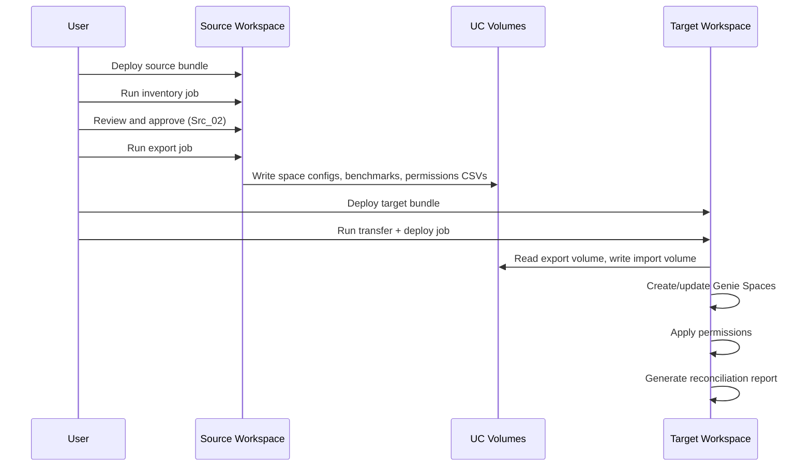

# Genie Space Migration Requirements

## Overview

Migrate Databricks Genie Spaces between **two different Databricks workspaces** using workflows and Databricks Asset Bundles (DABs). This migration pattern follows the same structure as the existing **Model Migration** and **Lakeview Dashboard Migration** toolkits.

**Design principle:** Export → Transform → Deploy pattern with separate source and target bundles, using UC volumes for artifact transfer between workspaces on the same metastore.

**Authentication:** A **Service Principal (SP)** with access to both workspaces is used to run the migration jobs. The SP must have permissions to:
- Read Genie Spaces and export configurations in the source workspace
- Create/update Genie Spaces and apply permissions in the target workspace
- Access Unity Catalog volumes in both workspaces (shared metastore)

---

## Scope

### In Scope

| Component | Description |
|-----------|-------------|
| **Genie Space configuration** | Title, description, serialized_space (instructions, sample questions, data sources, SQL snippets) |
| **Benchmarks** | Benchmark questions and gold-standard SQL answers (up to 500 per space) |
| **Permissions** | CAN_MANAGE, CAN_EDIT, CAN_RUN, CAN_VIEW ACLs on migrated spaces |
| **Monitoring** | Benchmark evaluation history, deployment audit trail, reconciliation reports |
| **Inventory** | Discovery and approval workflow for selecting spaces to migrate |

### Out of Scope

| Component | Reason |
|-----------|--------|
| **Conversation history** | Workspace-specific; not portable via API |
| **UC function definitions** | `serialized_space` contains references, not definitions; functions must exist in target catalog |
| **UC table/view grants** | Must be configured separately via Unity Catalog |
| **Cross-metastore migration** | Source and target must share a UC metastore |

---

## Architecture

### Two-Bundle Design

```
┌──────────────────────────────────────────────────────────────────────────────┐
│                            SOURCE WORKSPACE                                  │
├──────────────────────────────────────────────────────────────────────────────┤
│  source/                                                                     │
│    databricks.yml                                                            │
│    resources/src_genie_jobs.yml                                              │
│    notebooks/                                                                │
│      Src_01_Inventory_Generation.ipynb                                       │
│      Src_02_Review_and_Approve.ipynb                                         │
│      Src_03_Export_Genie_Spaces.ipynb                                        │
│    helpers/                                                                  │
│      discovery.py, export.py, permissions.py, benchmarks.py                  │
└──────────────────────────────────────────────────────────────────────────────┘
                                     │
                                     ▼  (UC Volume: same metastore)
┌──────────────────────────────────────────────────────────────────────────────┐
│                            TARGET WORKSPACE                                  │
├──────────────────────────────────────────────────────────────────────────────┤
│  target/                                                                     │
│    databricks.yml                                                            │
│    resources/tgt_genie_jobs.yml                                              │
│    notebooks/                                                                │
│      Tgt_01_Transfer_Volume.ipynb                                            │
│      Tgt_02_Deploy_Genie_Spaces.ipynb                                        │
│      Tgt_03_Apply_Permissions.ipynb                                          │
│      Tgt_04_Reconciliation.ipynb                                             │
│    helpers/                                                                  │
│      deployer.py, permissions.py, reconciliation.py                          │
└──────────────────────────────────────────────────────────────────────────────┘
```

### Workflow Phases



---

## Detailed Requirements

### 1. Inventory Generation (Src_01)

**Purpose:** Discover all Genie Spaces in the source workspace and generate an inventory for review.

| Requirement | Details |
|-------------|---------|
| List all spaces | Use `w.workspace.list()` to find Genie Spaces |
| Extract metadata | space_id, title, description, warehouse_id, parent_path, created_at |
| Count benchmarks | For each space, count benchmark questions |
| Export inventory | Write `genie_inventory.csv` to export volume |
| Filter options | Allow filtering by parent_path prefix or tags |

**Output schema:**

```csv
space_id,title,description,parent_path,warehouse_id,benchmark_count,created_by,created_at
```

### 2. Review and Approval (Src_02)

**Purpose:** Manual review step to select which spaces to migrate.

| Requirement | Details |
|-------------|---------|
| Display inventory | Show all discovered spaces with metadata |
| Selection UI | Allow user to select/deselect individual spaces |
| Confirmation | Require explicit CONFIRM input before proceeding |
| Save approved list | Write `inventory_approved.csv` to export volume |

### 3. Export (Src_03)

**Purpose:** Export full Genie Space configurations including benchmarks.

| Requirement | Details |
|-------------|---------|
| Export serialized_space | Call `w.genie.get_space(include_serialized_space=True)` |
| Export benchmarks | Extract benchmarks from serialized_space or via API |
| Export permissions | Use `w.permissions.get()` for each space |
| Catalog/schema references | Extract data_sources for transformation mapping |
| Write artifacts | JSON files per space + consolidated CSVs |

**Exported artifacts per space:**

```
/Volumes/<catalog>/<schema>/<export_volume>/
├── genie_inventory/
│   └── genie_inventory.csv
├── genie_inventory_approved/
│   └── inventory_approved.csv
├── exported/
│   ├── <space_title>.json          # Full space config + metadata
│   └── ...
├── permissions/
│   ├── <space_title>_permissions.json
│   └── permissions_all.csv
├── benchmarks/
│   ├── <space_title>_benchmarks.json
│   └── benchmarks_all.csv
└── mappings/
    └── catalog_schema_mapping.csv  # (optional) for transformation
```

**Space JSON structure:**

```json
{
  "_metadata": {
    "exported_at": "2026-03-30T10:00:00Z",
    "source_space_id": "abc123...",
    "source_workspace": "https://adb-xxx.azuredatabricks.net",
    "export_version": "1.0"
  },
  "title": "Sales Assistant",
  "description": "Ask questions about sales data",
  "warehouse_id": "source_warehouse_id",
  "serialized_space": "{...}",
  "benchmarks": [
    {
      "question": "What were total sales last month?",
      "sql_answer": "SELECT SUM(amount) FROM sales WHERE ..."
    }
  ],
  "permissions": [
    {
      "principal": "user@company.com",
      "permission_level": "CAN_EDIT"
    }
  ],
  "data_sources": {
    "tables": ["catalog.schema.table1", "catalog.schema.table2"]
  }
}
```

### 4. Transform (Optional)

**Purpose:** Modify catalog/schema references for target environment.

| Requirement | Details |
|-------------|---------|
| Mapping CSV | Read `catalog_schema_mapping.csv` from volume |
| Replace references | Update `data_sources` in serialized_space |
| Validate mapping | Ensure all source references have target mappings |
| Write transformed | Output to `transformed/` folder |

**Mapping CSV schema:**

```csv
old_catalog,old_schema,old_table,new_catalog,new_schema,new_table
source_catalog,source_schema,,target_catalog,target_schema,
```

### 5. Transfer (Tgt_01)

**Purpose:** Copy artifacts from source export volume to target import volume.

| Requirement | Details |
|-------------|---------|
| Shared metastore | Both volumes visible from target workspace |
| Copy all artifacts | JSON files, CSVs, mappings |
| Create import volume | `CREATE VOLUME IF NOT EXISTS` |
| Verify integrity | Count files, validate JSON |

### 6. Deploy (Tgt_02)

**Purpose:** Create or update Genie Spaces in target workspace.

| Requirement | Details |
|-------------|---------|
| Idempotent deployment | Check for existing space by title in target_parent_path |
| Create new space | `w.genie.create_space()` with serialized_space |
| Update existing space | `w.genie.update_space()` with target_space_id |
| Set warehouse | Use target_warehouse_id |
| Deploy benchmarks | Include in serialized_space (benchmarks are embedded) |
| Log space IDs | Record source→target space_id mapping |

**Deployment behavior:**

| Scenario | Behavior |
|----------|----------|
| No existing space | Creates new space, logs new space_id |
| Existing space found by title | Updates that space |
| target_space_id provided | Updates specified space (recommended for idempotency) |

### 7. Apply Permissions (Tgt_03)

**Purpose:** Recreate ACLs on deployed Genie Spaces.

| Requirement | Details |
|-------------|---------|
| Read exported permissions | From `permissions/` folder |
| Map principals | Optionally map source→target usernames/groups |
| Apply permissions | Use `w.permissions.set()` or bundle permissions |
| Handle missing principals | Log warning if principal doesn't exist in target |

**Permission levels:**

| Level | Description |
|-------|-------------|
| CAN_MANAGE | Full control (auto-granted to creator) |
| CAN_EDIT | Edit space, run benchmarks, modify instructions |
| CAN_RUN | Run queries, view results |
| CAN_VIEW | View-only access |

### 8. Reconciliation (Tgt_04)

**Purpose:** Generate a report comparing source and target state.

| Requirement | Details |
|-------------|---------|
| Count comparison | Number of spaces source vs target |
| Benchmark validation | Benchmark count source vs target |
| Permission validation | Compare ACL counts |
| Data source check | Verify tables exist in target catalog |
| Output report | Write `reconciliation_report.csv` and summary |

**Reconciliation report schema:**

```csv
source_space_id,source_title,target_space_id,target_title,status,benchmarks_match,permissions_match,notes
abc123,Sales Assistant,def456,Sales Assistant,SUCCESS,true,true,
```

---

## Monitoring Requirements

### Benchmark Monitoring

| Requirement | Details |
|-------------|---------|
| Export evaluation history | If available via API, export past benchmark runs |
| Re-run benchmarks post-deploy | Optional job to run benchmarks in target |
| Compare accuracy | Source vs target benchmark accuracy |

### Audit Trail

| Requirement | Details |
|-------------|---------|
| Git versioning | Commit exported configs to git for audit |
| Deployment logs | Job run logs with space_id mappings |
| Timestamp tracking | Export and deploy timestamps in metadata |

### Health Checks

| Requirement | Details |
|-------------|---------|
| Warehouse connectivity | Verify target warehouse is accessible |
| Table accessibility | Check UC grants on data_sources tables |
| SP permissions | Validate service principal has required access |

---

## Prerequisites

### Infrastructure

| Requirement | Details |
|-------------|---------|
| **Databricks CLI** | v0.278.0+ (for Genie API support) |
| **Same UC metastore** | Source and target catalogs on same metastore |
| **Export volume** | UC volume in source catalog |
| **Import volume** | UC volume in target catalog (auto-created) |
| **SQL warehouse** | Target warehouse for Genie queries |

### Permissions

#### Service Principal (Source Workspace)

| Permission | On | Why |
|------------|-------|-----|
| CAN_EDIT | Each Genie Space | Required for `include_serialized_space=True` |
| READ VOLUME | Export volume | Write exported configs |
| WRITE VOLUME | Export volume | Write exported configs |
| Workspace access | Source workspace | SP must be added to source workspace |

#### Service Principal (Target Workspace)

| Permission | On | Why |
|------------|-------|-----|
| CAN USE | SQL Warehouse | Genie queries run here |
| CAN MANAGE | Target parent folder | Create new Genie Spaces |
| READ VOLUME | Import volume | Read transferred configs |
| WRITE VOLUME | Import volume | Transfer notebook writes here |
| USE CATALOG / USE SCHEMA | Target catalog/schema | Access data sources |
| Workspace access | Target workspace | SP must be added to target workspace |

### Cross-Workspace Service Principal Setup

The Service Principal must be configured in **both workspaces**:

```
┌────────────────────────────────────────────────────────────────────────────┐
│                         ACCOUNT CONSOLE                                    │
│  1. Create Service Principal (SP) with Application ID                     │
│  2. Generate OAuth secret or configure Azure AD authentication            │
└────────────────────────────────────────────────────────────────────────────┘
                                    │
        ┌───────────────────────────┴───────────────────────────┐
        ▼                                                       ▼
┌───────────────────────────┐                   ┌───────────────────────────┐
│   SOURCE WORKSPACE        │                   │   TARGET WORKSPACE        │
│   - Add SP to workspace   │                   │   - Add SP to workspace   │
│   - Grant CAN_EDIT on     │                   │   - Grant CAN_MANAGE on   │
│     Genie Spaces          │                   │     target folder         │
│   - Grant volume access   │                   │   - Grant volume access   │
│   - Grant job run perms   │                   │   - Grant warehouse use   │
└───────────────────────────┘                   └───────────────────────────┘
```

### Authentication

| Method | Supported | Notes |
|--------|-----------|-------|
| OAuth (recommended) | Yes | SP with OAuth secret |
| Azure AD (for Azure) | Yes | SP with Azure AD authentication |
| Azure CLI | Yes | For interactive development |
| PAT | Not recommended | Security risk; avoid for production |

---

## Known Limitations

| Limitation | Impact | Mitigation |
|------------|--------|------------|
| **No conversation history** | Conversations are workspace-specific | N/A — users start fresh |
| **UC permissions not migrated** | Table grants must be configured separately | Document in SETUP.md |
| **Table names deployed as-is** | Must edit JSON if catalog/schema differ | Use transformation mapping |
| **UC Functions not migrated** | Function references only, not definitions | Ensure functions exist in target |
| **Benchmark evaluations** | Past evaluation runs not migrated | Run new benchmarks post-deploy |
| **DABs native support pending** | PR #4191 still open; use API workaround | Use notebooks + Genie SDK |
| **Direct mode only** | No Terraform support for Genie Spaces | Use DATABRICKS_BUNDLE_ENGINE=direct |

---

## File Structure

```
GenieMigration/
├── README.md                        # Overview and quick start
├── REQUIREMENTS.md                  # This file
├── SETUP.md                         # Detailed setup guide
├── PREREQUISITES_CHECKLIST.md       # Pre-flight checklist
├── source/                          # Source bundle
│   ├── databricks.yml
│   ├── resources/
│   │   └── src_genie_jobs.yml
│   ├── notebooks/
│   │   ├── Src_01_Inventory_Generation.ipynb
│   │   ├── Src_02_Review_and_Approve.ipynb
│   │   └── Src_03_Export_Genie_Spaces.ipynb
│   └── helpers/
│       ├── __init__.py
│       ├── discovery.py
│       ├── export.py
│       ├── permissions.py
│       └── benchmarks.py
├── target/                          # Target bundle
│   ├── databricks.yml
│   ├── resources/
│   │   └── tgt_genie_jobs.yml
│   ├── notebooks/
│   │   ├── Tgt_01_Transfer_Volume.ipynb
│   │   ├── Tgt_02_Deploy_Genie_Spaces.ipynb
│   │   ├── Tgt_03_Apply_Permissions.ipynb
│   │   └── Tgt_04_Reconciliation.ipynb
│   └── helpers/
│       ├── __init__.py
│       ├── deployer.py
│       ├── permissions.py
│       └── reconciliation.py
└── templates/
    └── catalog_schema_mapping_template.csv
```

---

## Jobs Reference

| Bundle | Job Name | CLI Key | What It Does |
|--------|----------|---------|--------------|
| Source | [Src] Genie Inventory | `src_genie_inventory` | Discover all Genie Spaces, generate inventory CSV |
| Source | [Src] Genie Export | `src_genie_export` | Export approved spaces with benchmarks + permissions |
| Target | [Tgt] Genie Deploy | `tgt_genie_deploy` | Transfer → Deploy → Permissions → Reconciliation |

---

## Command Reference

### Source Workspace

```bash
# Deploy source bundle
cd source
databricks bundle validate --profile <source-profile>
databricks bundle deploy --profile <source-profile>

# Generate inventory
databricks bundle run src_genie_inventory --profile <source-profile>

# (Manual) Review and approve in Src_02_Review_and_Approve.ipynb

# Export approved spaces
databricks bundle run src_genie_export --profile <source-profile>
```

### Target Workspace

```bash
# Deploy target bundle
cd ../target
databricks bundle validate --profile <target-profile>
databricks bundle deploy --profile <target-profile>

# Transfer and deploy (runs all target notebooks in sequence)
databricks bundle run tgt_genie_deploy --profile <target-profile>
```

---

## References

- [Genie Space API Documentation](https://docs.databricks.com/api/workspace/genie)
- [DABs Genie Support PR #4191](https://github.com/databricks/cli/pull/4191)
- [GitHub Example: hiydavid/genie-migration](https://github.com/hiydavid/databricks-genai-examples/tree/main/aibi/genie-migration)
- [Genie overview and setup](https://docs.databricks.com/en/genie/index.html)
- [Benchmarks Documentation](https://docs.databricks.com/en/genie/benchmarks.html)
- [Lakeview Dashboard Migration Toolkit](../Lakeview%20Dashboard%20Migration/) — pattern reference
- [UC Model Migration Toolkit](../GM-AandC/Model%20Migration/) — pattern reference
