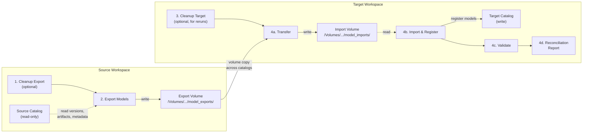

# UC Model Migration — Single-Environment Pipeline

Migrate MLflow registered models from one Unity Catalog catalog to another on the **same metastore**. Source models are never modified or deleted. Model names are preserved. Works on both serverless and classic compute.

## Migration Flow



**What gets migrated:** Registered model versions, artifacts, metrics, params, tags, and aliases. Source experiments are not copied — new migration experiments are created in the target to house re-logged model versions.

**What is never touched:** Source registered models and experiments are read-only throughout the entire process.

## How It Works — Volume-Based Re-Log via MLflow SDK

This pipeline uses the **MLflow Python SDK** (`mlflow` + `MlflowClient`) with a volume-based re-log approach. It does not use Delta table deep clones, the MLflow Import/Export REST API, or a third-party migration CLI tool.

### Export (source workspace)

| What's exported | SDK method | Stored as |
|---|---|---|
| Model artifacts (pickle, MLmodel, etc.) | `mlflow.artifacts.download_artifacts()` | `{volume}/{model_dir}/v{N}/model/` |
| Metrics (accuracy, f1, etc.) | `client.get_run(run_id).data.metrics` | `metadata.json` per version |
| Params (n_estimators, etc.) | `client.get_run(run_id).data.params` | `metadata.json` per version |
| Tags (custom user tags) | `client.get_run(run_id).data.tags` | `metadata.json` per version |
| Aliases (Champion, Challenger, Shadow) | `client.get_model_version_by_alias()` | `metadata.json` per version |
| Model signature (input/output schema) | `mlflow.models.get_model_info().signature` | `metadata.json` per version |
| Version inventory | `client.search_model_versions()` | `model_manifest.json` + `manifest.json` |

### Transfer

All exported files are copied from the source export volume to the target import volume using `shutil.copytree` / `shutil.copy2` over `/Volumes/` paths (same metastore, cross-catalog).

### Import (target workspace)

| What's imported | SDK method |
|---|---|
| Load model artifact from volume | `mlflow.sklearn.load_model(path)` |
| Register model in target catalog | `mlflow.sklearn.log_model(registered_model_name=target_model)` |
| Restore metrics | `mlflow.log_metric()` in a new run |
| Restore params | `mlflow.log_param()` in a new run |
| Restore tags | `mlflow.set_tag()` (system `mlflow.*` tags are skipped) |
| Traceability tags | `mlflow.set_tag("migration.source_model", ...)` etc. |
| Restore aliases | `client.set_registered_model_alias()` |

### Key implications

- Each model version gets a **new run ID** and **new version number** in the target. The original source version and run are tracked via `migration.source_version` and `migration.source_run_id` tags on each target run.
- **Model names are preserved** — the short name (e.g., `body_alignment`) is identical in both source and target catalogs. No `_migrated`, `_copy`, or other suffixes are added.
- Volume directories use double underscores (`catalog__schema__model`) as a filesystem-safe representation of the dot-separated UC name. This is internal to the volume and does not affect registered model names.

## 4 Workflows, 2 Bundles

| Workflow | Bundle | Deploy to | Run command |
|---|---|---|---|
| **src_model_migration_cleanup** | `source/` | Source workspace | `cd source && databricks bundle run src_model_migration_cleanup` |
| **src_model_export** | `source/` | Source workspace | `cd source && databricks bundle run src_model_export` |
| **tgt_model_migration_cleanup** | `target/` | Target workspace | `cd target && databricks bundle run tgt_model_migration_cleanup` |
| **tgt_model_migration_register** | `target/` | Target workspace | `cd target && databricks bundle run tgt_model_migration_register` |

### Workflow Details

**`src_model_migration_cleanup`** (Source, optional)
Clears all contents of the source export volume. Run this before exporting if you want a clean slate, or to remove artifacts from a previous migration. Does **not** touch any source registered models or experiments. Safe to skip on first run.

**`src_model_export`** (Source, required)
Reads all specified models from the source catalog, exports every version's artifacts, metrics, params, tags, and aliases to the export volume. Creates a manifest file for the target to consume. This is a read-only operation against source models.

**`tgt_model_migration_cleanup`** (Target, optional)
Clears the target import volume and deletes all model versions, registered models, aliases, and migration experiments in the target catalog for the specified model names. Run this before a rerun to ensure a clean target state. **Destructive to target only** — never touches source.

**`tgt_model_migration_register`** (Target, required)
Runs 4 tasks in sequence:
- **Transfer** — Copies exported artifacts from the source export volume to the target import volume (cross-catalog volume copy).
- **Import & Register** — Re-logs each model version into a new migration experiment in the target catalog, preserving metrics, params, tags, and aliases.
- **Validate** — Verifies that all model versions were registered correctly in the target catalog.
- **Reconciliation Report** — Compares model version counts and aliases between source and target, producing a summary report.

### When to Use Each Workflow

- **First migration:** Run `src_model_export` then `tgt_model_migration_register`. Skip both cleanup workflows.
- **Rerun / retry:** Run all 4 in order — both cleanups first to reset state, then export and register.
- **Add new models:** Update `model_names` in both `databricks.yml` files, then run export and register (no cleanup needed if existing models should be preserved).

## Quick Start

```bash
# 1. Authenticate to both workspaces
databricks auth login -p <src-profile> --host <source-workspace-url>
databricks auth login -p <tgt-profile> --host <target-workspace-url>

# 2. Set variables in source/databricks.yml and target/databricks.yml

# 3. Deploy both bundles
cd source && databricks bundle validate && databricks bundle deploy
cd ../target && databricks bundle validate && databricks bundle deploy

# 4. Run in order
cd ../source && databricks bundle run src_model_migration_cleanup
cd ../source && databricks bundle run src_model_export
cd ../target && databricks bundle run tgt_model_migration_cleanup
cd ../target && databricks bundle run tgt_model_migration_register
```

## Variables

Set in each bundle's `databricks.yml`:

| Variable | Description |
|---|---|
| `source_catalog` | Source UC catalog |
| `target_catalog` | Target UC catalog |
| `schema` | Schema name |
| `model_names` | Comma-separated model short names |
| `export_volume` | Export volume name |
| `import_volume` | Import volume name (target bundle only) |

## Prerequisites

- Databricks CLI (v0.278.0+); auth via OAuth or Azure CLI.
- Source and target catalogs on the **same Unity Catalog metastore**.
- Permissions: read models in source; create/use target catalog, schema, volume; run jobs.

See **SETUP.md** for compute options, customization, and known limitations. See **REQUIREMENTS.md** for full design.
